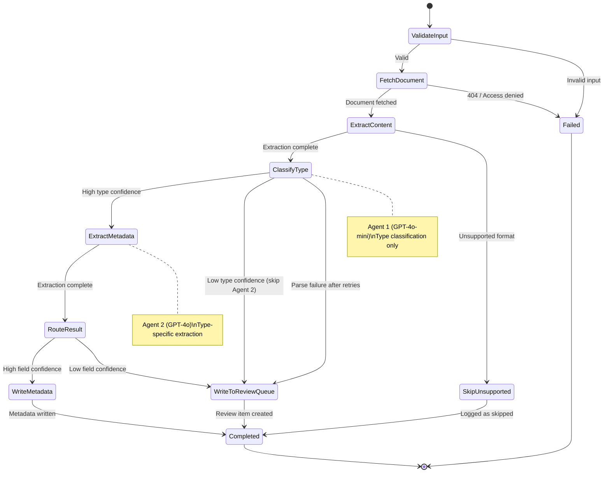
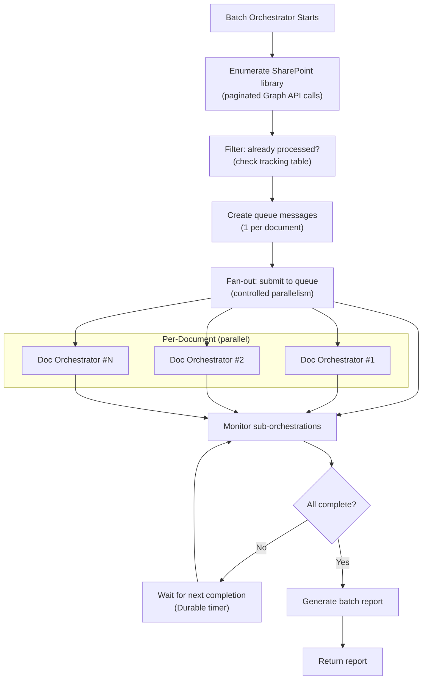
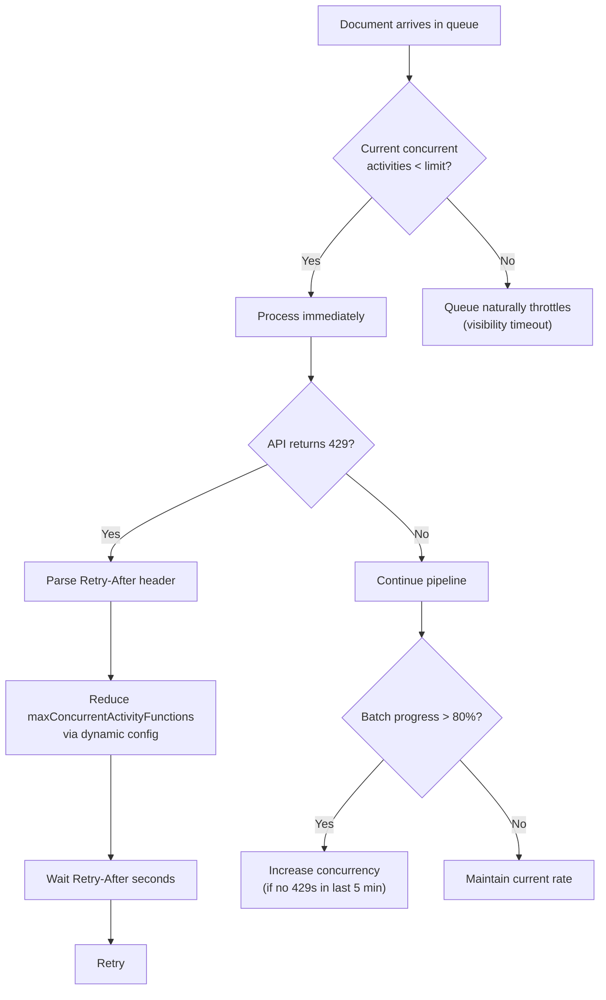

# Durable Functions Orchestration — Deep Dive

## 1. Why Durable Functions

The document classification pipeline needs:

- **Reliable execution** — if a classification call fails mid-pipeline, resume from where it left off
- **Fan-out/fan-in** — batch mode processes thousands of documents concurrently with controlled parallelism
- **Progress tracking** — batch mode needs to report how many documents are processed/remaining/failed
- **Timeout handling** — individual document processing has a deadline; batch has an overall deadline
- **Compensation** — if write-back fails after classification succeeds, don't re-classify

Durable Functions provides all of this out of the box with checkpointed orchestrator replay.

## 2. Orchestrator Design

### Document Processing Orchestrator (Single Document)



### Python Implementation Pattern

```python
# orchestrators/document_orchestrator.py

import azure.durable_functions as df
from datetime import timedelta
from models.pipeline import QueueMessage, ExtractionResult, TypeClassification, MetadataExtraction, RoutingDecision

def document_orchestrator(ctx: df.DurableOrchestrationContext):
    """Process a single document: extract → classify type → extract metadata → route."""
    
    # 1. Parse input
    input_data = ctx.get_input()
    message = QueueMessage.model_validate(input_data)
    
    # 2. Fetch document content from SharePoint
    document_content = yield ctx.call_activity_with_retry(
        "fetch_document",
        retry_options=df.RetryOptions(
            first_retry_interval_in_milliseconds=5000,
            max_number_of_attempts=3,
            backoff_coefficient=2.0,
        ),
        input_=message.model_dump(),
    )
    
    # 3. Extract text via Document Intelligence
    extraction_result: ExtractionResult = yield ctx.call_activity_with_retry(
        "extract_content",
        retry_options=df.RetryOptions(
            first_retry_interval_in_milliseconds=5000,
            max_number_of_attempts=3,
            backoff_coefficient=2.0,
            max_retry_interval_in_milliseconds=30000,
        ),
        input_={
            "document_url": message.file_url,
            "content_type": message.content_type,
        },
    )
    
    # 4. Classify type via Agent 1 (GPT-4o-mini)
    type_result: TypeClassification = yield ctx.call_activity_with_retry(
        "classify_type",
        retry_options=df.RetryOptions(
            first_retry_interval_in_milliseconds=3000,
            max_number_of_attempts=3,
            backoff_coefficient=2.0,
        ),
        input_={
            "document_id": message.document_id,
            "file_name": message.file_name,
            "extracted_text": extraction_result["text"],
            "key_value_pairs": extraction_result["key_value_pairs"],
        },
    )
    
    # 5. If type confidence is below threshold, skip extraction and route to review
    if type_result["confidence"] < type_result["threshold"]:
        routing = yield ctx.call_activity(
            "route_result",
            input_={
                "document_id": message.document_id,
                "file_name": message.file_name,
                "site_id": message.site_id,
                "drive_id": message.drive_id,
                "item_id": message.item_id,
                "type_classification": type_result,
                "metadata_extraction": None,
                "source": message.source,
                "batch_id": message.batch_id,
                "skip_reason": "low_type_confidence",
            },
        )
        return routing
    
    # 6. Extract metadata via Agent 2 (GPT-4o), using document_type from step 4
    metadata_result: MetadataExtraction = yield ctx.call_activity_with_retry(
        "extract_metadata",
        retry_options=df.RetryOptions(
            first_retry_interval_in_milliseconds=3000,
            max_number_of_attempts=3,
            backoff_coefficient=2.0,
        ),
        input_={
            "document_id": message.document_id,
            "file_name": message.file_name,
            "document_type": type_result["document_type"],
            "extracted_text": extraction_result["text"],
            "key_value_pairs": extraction_result["key_value_pairs"],
        },
    )
    
    # 7. Route based on both type and field confidences
    routing = yield ctx.call_activity(
        "route_result",
        input_={
            "document_id": message.document_id,
            "file_name": message.file_name,
            "site_id": message.site_id,
            "drive_id": message.drive_id,
            "item_id": message.item_id,
            "type_classification": type_result,
            "metadata_extraction": metadata_result,
            "source": message.source,
            "batch_id": message.batch_id,
        },
    )
    
    return routing


main = df.Blueprint()

@main.orchestration_trigger(context_name="ctx")
def document_processing_orchestrator(ctx: df.DurableOrchestrationContext):
    return document_orchestrator(ctx)
```

### Batch Orchestrator (Fan-Out/Fan-In)



```python
# orchestrators/batch_orchestrator.py

import azure.durable_functions as df
from datetime import timedelta

def batch_orchestrator(ctx: df.DurableOrchestrationContext):
    """Enumerate a SharePoint library and process all documents in parallel."""
    
    input_data = ctx.get_input()
    site_id = input_data["site_id"]
    drive_id = input_data["drive_id"]
    batch_id = ctx.instance_id  # Use orchestration instance ID as batch ID
    max_concurrency = input_data.get("max_concurrency", 20)
    
    # 1. Enumerate all documents in the library
    documents = yield ctx.call_activity(
        "enumerate_library",
        input_={"site_id": site_id, "drive_id": drive_id},
    )
    
    # 2. Filter already-processed documents
    unprocessed = yield ctx.call_activity(
        "filter_processed",
        input_={"documents": documents, "batch_id": batch_id},
    )
    
    # 3. Fan-out with controlled parallelism
    # Process in chunks to avoid overwhelming the system
    results = []
    for i in range(0, len(unprocessed), max_concurrency):
        chunk = unprocessed[i : i + max_concurrency]
        
        # Start sub-orchestrations for this chunk
        tasks = []
        for doc in chunk:
            task = ctx.call_sub_orchestrator(
                "document_processing_orchestrator",
                input_={
                    "document_id": doc["id"],
                    "site_id": site_id,
                    "drive_id": drive_id,
                    "item_id": doc["id"],
                    "file_name": doc["name"],
                    "file_url": doc["downloadUrl"],
                    "content_type": doc["mimeType"],
                    "modified_date_time": doc["lastModifiedDateTime"],
                    "source": "batch",
                    "batch_id": batch_id,
                    "attempt_number": 1,
                },
                instance_id=f"{batch_id}:{doc['id']}",
            )
            tasks.append(task)
        
        # Wait for all in this chunk to complete
        chunk_results = yield ctx.task_all(tasks)
        results.extend(chunk_results)
        
        # Log progress
        ctx.set_custom_status({
            "processed": len(results),
            "total": len(unprocessed),
            "percentComplete": round(len(results) / len(unprocessed) * 100, 1),
        })
    
    # 4. Generate batch report
    report = yield ctx.call_activity(
        "generate_batch_report",
        input_={"batch_id": batch_id, "results": results},
    )
    
    return report


main = df.Blueprint()

@main.orchestration_trigger(context_name="ctx")
def batch_processing_orchestrator(ctx: df.DurableOrchestrationContext):
    return batch_orchestrator(ctx)
```

## 3. Activity Implementations (Skeleton)

### Extract Content Activity

```python
# activities/extract_content.py

import azure.durable_functions as df
from azure.ai.documentintelligence import DocumentIntelligenceClient
from azure.ai.documentintelligence.models import AnalyzeDocumentRequest
from azure.identity import DefaultAzureCredential
from shared.config import get_settings

main = df.Blueprint()

@main.activity_trigger(input_name="input")
async def extract_content(input: dict) -> dict:
    """Call Azure AI Document Intelligence to extract text and key-value pairs."""
    
    settings = get_settings()
    credential = DefaultAzureCredential()
    client = DocumentIntelligenceClient(
        endpoint=settings.doc_intelligence_endpoint,
        credential=credential,
    )
    
    # Use prebuilt-read model for text extraction
    poller = client.begin_analyze_document(
        model_id="prebuilt-read",
        analyze_request=AnalyzeDocumentRequest(url_source=input["document_url"]),
    )
    result = poller.result()
    
    # Normalize output
    text = ""
    for page in result.pages:
        for line in page.lines:
            text += line.content + "\n"
        text += "\n--- PAGE BREAK ---\n\n"
    
    # Extract key-value pairs if present
    kv_pairs = []
    if result.key_value_pairs:
        for kv in result.key_value_pairs:
            if kv.key and kv.value:
                kv_pairs.append({
                    "key": kv.key.content,
                    "value": kv.value.content,
                    "confidence": kv.confidence,
                })
    
    return {
        "text": text,
        "page_count": len(result.pages),
        "text_length": len(text),
        "key_value_pairs": kv_pairs,
        "language": result.languages[0].locale if result.languages else "unknown",
    }
```

### Classify Type Activity (Agent 1 — GPT-4o-mini)

```python
# activities/classify_type.py

import json
import azure.durable_functions as df
from openai import AzureOpenAI
from azure.identity import DefaultAzureCredential, get_bearer_token_provider
from shared.config import get_settings
from shared.taxonomy import load_taxonomy
from shared.prompts import load_prompt_template

main = df.Blueprint()

@main.activity_trigger(input_name="input")
async def classify_type(input: dict) -> dict:
    """Agent 1: Classify document type against the taxonomy using GPT-4o-mini."""
    
    settings = get_settings()
    token_provider = get_bearer_token_provider(
        DefaultAzureCredential(),
        "https://cognitiveservices.azure.com/.default",
    )
    
    client = AzureOpenAI(
        azure_endpoint=settings.openai_endpoint,
        azure_ad_token_provider=token_provider,
        api_version="2024-12-01-preview",
    )
    
    taxonomy = load_taxonomy()
    prompt_template = load_prompt_template("classify_type")
    
    system_prompt = prompt_template.render(
        taxonomy=taxonomy,
        categories=taxonomy.categories,
    )
    
    user_prompt = f"""Classify the following document.

**File name:** {input['file_name']}

**Extracted key-value pairs:**
{json.dumps(input['key_value_pairs'], indent=2)}

**Document text (first 4000 chars):**
{input['extracted_text'][:4000]}
"""
    
    response = client.chat.completions.create(
        model=settings.openai_mini_deployment,  # GPT-4o-mini
        messages=[
            {"role": "system", "content": system_prompt},
            {"role": "user", "content": user_prompt},
        ],
        response_format={"type": "json_object"},
        temperature=0.1,
        max_tokens=500,
    )
    
    result = json.loads(response.choices[0].message.content)
    category = result["document_type"]
    threshold = taxonomy.get_threshold(category)
    
    return {
        "document_type": category,
        "confidence": result["confidence"],
        "threshold": threshold,
        "reasoning": result.get("reasoning", ""),
        "input_tokens": response.usage.prompt_tokens,
        "output_tokens": response.usage.completion_tokens,
    }
```

### Extract Metadata Activity (Agent 2 — GPT-4o)

```python
# activities/extract_metadata.py

import json
import azure.durable_functions as df
from openai import AzureOpenAI
from azure.identity import DefaultAzureCredential, get_bearer_token_provider
from shared.config import get_settings
from shared.prompts import load_prompt_template
from shared.schemas import load_extraction_schema

main = df.Blueprint()

@main.activity_trigger(input_name="input")
async def extract_metadata(input: dict) -> dict:
    """Agent 2: Extract type-specific metadata fields using GPT-4o with Structured Outputs."""
    
    settings = get_settings()
    token_provider = get_bearer_token_provider(
        DefaultAzureCredential(),
        "https://cognitiveservices.azure.com/.default",
    )
    
    client = AzureOpenAI(
        azure_endpoint=settings.openai_endpoint,
        azure_ad_token_provider=token_provider,
        api_version="2024-12-01-preview",
    )
    
    document_type = input["document_type"]
    prompt_template = load_prompt_template(f"extract_{document_type}")
    extraction_schema = load_extraction_schema(document_type)
    
    system_prompt = prompt_template.render(document_type=document_type)
    
    user_prompt = f"""Extract metadata from this {document_type} document.

**File name:** {input['file_name']}

**Extracted key-value pairs:**
{json.dumps(input['key_value_pairs'], indent=2)}

**Document text:**
{input['extracted_text'][:8000]}
"""
    
    response = client.chat.completions.create(
        model=settings.openai_deployment,  # GPT-4o
        messages=[
            {"role": "system", "content": system_prompt},
            {"role": "user", "content": user_prompt},
        ],
        response_format=extraction_schema,  # Structured Outputs
        temperature=0.1,
        max_tokens=2000,
    )
    
    result = json.loads(response.choices[0].message.content)
    
    return {
        "document_type": document_type,
        "fields": result["fields"],
        "field_confidences": result.get("field_confidences", {}),
        "input_tokens": response.usage.prompt_tokens,
        "output_tokens": response.usage.completion_tokens,
    }
```

## 4. Idempotency & Deduplication

### Trigger Mode Deduplication

Power Automate can fire duplicate events. The pipeline handles this via:

1. **Orchestrator instance ID** = `trigger:{siteId}:{itemId}:{modifiedDateTime}` — Durable Functions rejects duplicate instance IDs
2. If an orchestration is already running for this document, the HTTP trigger returns 409 (Conflict) — Power Automate logs and moves on

### Batch Mode Deduplication

1. **Tracking table** (Azure Table Storage) records every processed `{batchId}:{documentId}` with status
2. `filter_processed` activity checks this table before fanning out
3. If the batch orchestrator is interrupted and restarted, it resumes from the checkpoint (Durable Functions replay)

### Write-Back Idempotency

Writing metadata columns is inherently idempotent — writing the same values again has no side effect. The only risk is a stale write overwriting a human correction. Mitigated by:

- Checking `ReviewStatus` before write-back — if a document has been human-reviewed, don't overwrite
- Using SharePoint `@odata.etag` for optimistic concurrency on the review list

## 5. Scaling & Throttling

### Concurrency Controls

```python
# host.json — Azure Functions host configuration

{
  "version": "2.0",
  "extensions": {
    "durableTask": {
      "maxConcurrentActivityFunctions": 10,
      "maxConcurrentOrchestratorFunctions": 5
    },
    "queues": {
      "maxPollingInterval": "00:00:05",
      "visibilityTimeout": "00:05:00",
      "batchSize": 16,
      "maxDequeueCount": 5,
      "newBatchThreshold": 8
    }
  },
  "functionTimeout": "00:10:00",
  "logging": {
    "applicationInsights": {
      "samplingSettings": {
        "isEnabled": true,
        "excludedTypes": "Request;Dependency"
      }
    }
  }
}
```

### Throttling Strategy



### Throughput Estimates

| Concurrency | Doc Intelligence | OpenAI (60K TPM) | End-to-End Rate | 25K Docs ETA |
|-------------|-----------------|-------------------|-----------------|-------------|
| 5 concurrent | ~5/sec (well under 15/sec limit) | ~3/sec (~2K tokens/doc) | ~3 docs/sec | ~2.3 hours |
| 10 concurrent | ~10/sec (under limit) | ~3/sec (TPM bottleneck) | ~3 docs/sec | ~2.3 hours |
| 20 concurrent | ~15/sec (at limit) | ~3/sec (TPM bottleneck) | ~3 docs/sec | ~2.3 hours |

**Key insight:** OpenAI TPM is the bottleneck, not concurrency. With two agents, each document makes two LLM calls: `classify_type` (GPT-4o-mini, ~500 tokens) then `extract_metadata` (GPT-4o, ~2K tokens). Agent 1 is cheap and fast; Agent 2 dominates cost and latency. Documents routed to review at the type stage skip Agent 2 entirely, saving tokens.

With **300K TPM** (common production allocation):
| Concurrency | Rate | 25K Docs ETA |
|-------------|------|-------------|
| 10 | ~10 docs/sec | ~42 minutes |
| 15 | ~15 docs/sec (Doc Intelligence limit) | ~28 minutes |
