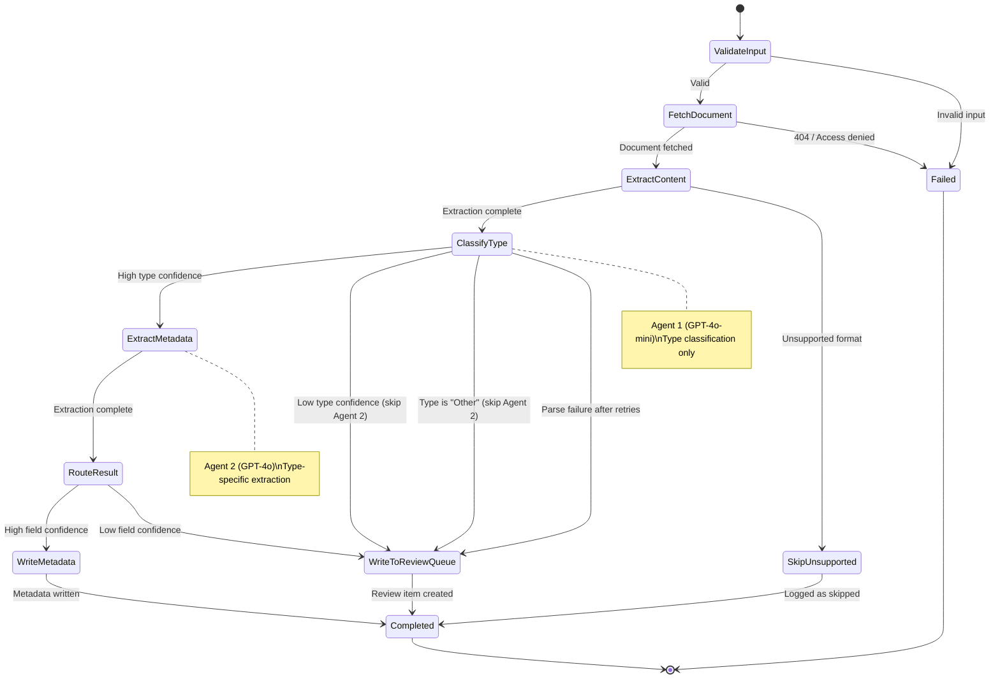
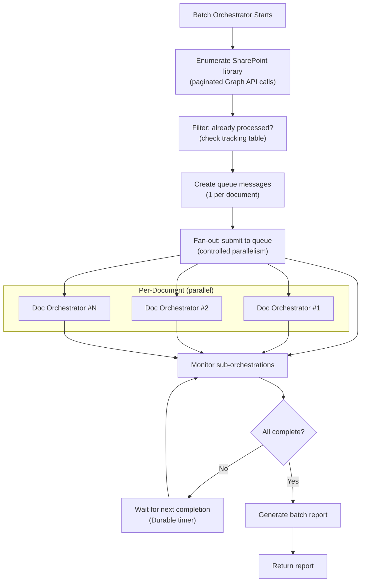
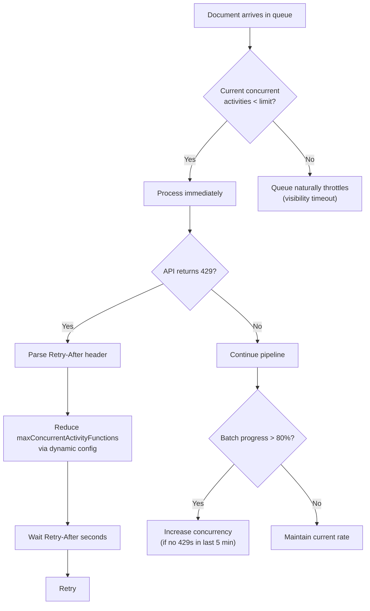

# Durable Functions Orchestration — Deep Dive

> ⚠️ **PARTIALLY STALE** — last substantively updated mid-Aug 2026, before the v4 taxonomy, the drawing
> vision path, and the folder-derived metadata model. The overall architecture is still accurate; specific
> field names, document types, and flows may not be. See [HANDOVER.md](../HANDOVER.md) §4 for what changed,
> and [taxonomy.yaml](../taxonomy/taxonomy.yaml) for the current configuration.

## 1. Why Durable Functions

The document classification pipeline needs:

- **Reliable execution** — if a classification call fails mid-pipeline, resume from where it left off
- **Fan-out/fan-in** — batch mode processes thousands of documents concurrently with controlled parallelism
- **Progress tracking** — batch mode needs to report how many documents are processed/remaining/failed
- **Timeout handling** — individual document processing has a deadline; batch has an overall deadline
- **Compensation** — if write-back fails after classification succeeds, don't re-classify

Durable Functions provides all of this out of the box with checkpointed orchestrator replay.

## 2. Orchestrator Design

### Document Processing Orchestrator (Single Document)



### .NET Isolated Worker Implementation Pattern

```csharp
// Orchestrators/DocumentOrchestrator.cs

using IdvEnrichment.Functions.Models;
using Microsoft.Azure.Functions.Worker;
using Microsoft.DurableTask;

namespace IdvEnrichment.Functions.Orchestrators;

public static class DocumentOrchestrator
{
    [Function(nameof(DocumentProcessingOrchestrator))]
    public static async Task<EnrichmentResult> DocumentProcessingOrchestrator(
        [OrchestrationTrigger] TaskOrchestrationContext ctx)
    {
        var message = ctx.GetInput<QueueMessage>()
            ?? throw new InvalidOperationException("Orchestrator input was null");

        var retry = TaskOptions.FromRetryPolicy(new RetryPolicy(
            maxNumberOfAttempts: 3,
            firstRetryInterval: TimeSpan.FromSeconds(5),
            backoffCoefficient: 2.0));

        // 1. Get pre-authenticated download URL from Graph API
        //    @microsoft.graph.downloadUrl is short-lived and accessible by Doc Intelligence directly.
        var downloadUrl = await ctx.CallActivityAsync<string>(
            "GetDocumentDownloadUrl", message, retry);

        // 2. Extract text via Document Intelligence (using the download URL)
        var extraction = await ctx.CallActivityAsync<ExtractionResult>(
            "ExtractContent",
            new ExtractContentInput(downloadUrl, message.ContentType),
            retry);

        // 3. Classify type via Agent 1 (GPT-4o-mini)
        var typeResult = await ctx.CallActivityAsync<TypeClassificationResult>(
            "ClassifyType",
            new ClassifyTypeInput(message.DocumentId, message.FileName, extraction.Text, extraction.KeyValuePairs),
            TaskOptions.FromRetryPolicy(new RetryPolicy(3, TimeSpan.FromSeconds(3), 2.0)));

        // 4. Load threshold from taxonomy config; skip Agent 2 if type confidence is low or type is "Other"
        var typeThreshold = await ctx.CallActivityAsync<double>("GetTypeConfidenceThreshold", typeResult.DocumentType);
        var skipExtraction = typeResult.Confidence < typeThreshold
            || typeResult.DocumentType == DocumentType.Other;

        MetadataExtractionResult? metadata = null;
        if (!skipExtraction)
        {
            // 5. Extract metadata via Agent 2 (GPT-4o), using document_type from step 3
            metadata = await ctx.CallActivityAsync<MetadataExtractionResult>(
                "ExtractMetadata",
                new ExtractMetadataInput(message.DocumentId, message.FileName, typeResult.DocumentType, extraction.Text, extraction.KeyValuePairs),
                TaskOptions.FromRetryPolicy(new RetryPolicy(3, TimeSpan.FromSeconds(3), 2.0)));
        }

        // 6. Route based on both type and field confidences
        return await ctx.CallActivityAsync<EnrichmentResult>(
            "RouteResult",
            new RouteResultInput(message, typeResult, metadata));
    }
}
```

### Batch Orchestrator (Fan-Out/Fan-In)



```csharp
// Orchestrators/BatchOrchestrator.cs

using IdvEnrichment.Functions.Models;
using Microsoft.Azure.Functions.Worker;
using Microsoft.DurableTask;

namespace IdvEnrichment.Functions.Orchestrators;

public static class BatchOrchestrator
{
    [Function(nameof(BatchProcessingOrchestrator))]
    public static async Task<BatchReport> BatchProcessingOrchestrator(
        [OrchestrationTrigger] TaskOrchestrationContext ctx)
    {
        var input = ctx.GetInput<BatchRequest>()
            ?? throw new InvalidOperationException("Batch orchestrator input was null");

        var batchId = ctx.InstanceId;
        var maxConcurrency = input.MaxConcurrency ?? 20;

        // 1. Resolve SharePoint URL to siteId + driveId + optional folderPath
        var target = await ctx.CallActivityAsync<ResolvedSharePointTarget>(
            "ResolveSharePointTarget",
            input.Url);

        // 2. Enumerate all documents in the library/folder
        var documents = await ctx.CallActivityAsync<IReadOnlyList<LibraryDocument>>(
            "EnumerateLibrary",
            target);

        // 2. Filter already-processed documents
        var unprocessed = await ctx.CallActivityAsync<IReadOnlyList<LibraryDocument>>(
            "FilterProcessed",
            new { Documents = documents, BatchId = batchId });

        // 3. Fan-out with controlled parallelism (chunked)
        var results = new List<EnrichmentResult>(unprocessed.Count);
        for (var i = 0; i < unprocessed.Count; i += maxConcurrency)
        {
            var chunk = unprocessed.Skip(i).Take(maxConcurrency).ToList();

            var tasks = chunk.Select(doc => ctx.CallSubOrchestratorAsync<EnrichmentResult>(
                nameof(DocumentOrchestrator.DocumentProcessingOrchestrator),
                new QueueMessage(
                    DocumentId: doc.Id,
                    SiteId: target.SiteId,
                    DriveId: target.DriveId,
                    ItemId: doc.Id,
                    FileName: doc.Name,
                    FileUrl: doc.DownloadUrl,
                    ContentType: doc.MimeType,
                    ModifiedDateTime: doc.LastModifiedDateTime,
                    Source: ProcessingSource.Batch,
                    BatchId: batchId),
                new TaskOptions { InstanceId = $"{batchId}:{doc.Id}" }))
                .ToList();

            var chunkResults = await Task.WhenAll(tasks);
            results.AddRange(chunkResults);

            // Progress tracking — surfaced via Durable Task status query APIs
            ctx.SetCustomStatus(new
            {
                Processed = results.Count,
                Total = unprocessed.Count,
                PercentComplete = Math.Round(results.Count / (double)unprocessed.Count * 100, 1),
            });
        }

        // 4. Generate batch report
        return await ctx.CallActivityAsync<BatchReport>(
            "GenerateBatchReport",
            new { BatchId = batchId, Results = results });
    }
}
```

## 3. Activity Implementations (Skeleton)

### Extract Content Activity

```csharp
// Activities/ExtractContentActivity.cs

using Azure.AI.DocumentIntelligence;
using Azure.Identity;
using IdvEnrichment.Functions.Configuration;
using IdvEnrichment.Functions.Models;
using Microsoft.Azure.Functions.Worker;
using Microsoft.Extensions.Options;

namespace IdvEnrichment.Functions.Activities;

public sealed class ExtractContentActivity(IOptions<PipelineSettings> settings)
{
    private readonly DocumentIntelligenceClient _client = new(
        new Uri(settings.Value.DocIntelligenceEndpoint),
        new DefaultAzureCredential());

    [Function(nameof(ExtractContent))]
    public async Task<ExtractionResult> ExtractContent(
        [ActivityTrigger] ExtractContentInput input)
    {
        var operation = await _client.AnalyzeDocumentAsync(
            WaitUntil.Completed,
            "prebuilt-read",
            new Uri(input.DocumentUrl));

        var result = operation.Value;
        var text = string.Join(
            Environment.NewLine + Environment.NewLine + "--- PAGE BREAK ---" + Environment.NewLine + Environment.NewLine,
            result.Pages.Select(p => string.Join(Environment.NewLine, p.Lines.Select(l => l.Content))));

        var kvPairs = (result.KeyValuePairs ?? [])
            .Where(kv => kv.Key is not null && kv.Value is not null)
            .Select(kv => new KeyValuePair(kv.Key!.Content, kv.Value!.Content, kv.Confidence))
            .ToList();

        return new ExtractionResult(
            Text: text,
            PageCount: result.Pages.Count,
            TextLength: text.Length,
            KeyValuePairs: kvPairs,
            Language: result.Languages?.FirstOrDefault()?.Locale ?? "unknown");
    }
}

public sealed record ExtractContentInput(string DocumentUrl, string ContentType);
```

### Classify Type Activity (Agent 1 — GPT-4o-mini)

```csharp
// Activities/ClassifyTypeActivity.cs

using Azure.AI.OpenAI;
using Azure.Identity;
using IdvEnrichment.Functions.Configuration;
using IdvEnrichment.Functions.Models;
using Microsoft.Azure.Functions.Worker;
using Microsoft.Extensions.Options;
using OpenAI.Chat;
using System.Text.Json;

namespace IdvEnrichment.Functions.Activities;

public sealed class ClassifyTypeActivity(IOptions<PipelineSettings> settings)
{
    private readonly ChatClient _chat = new AzureOpenAIClient(
            new Uri(settings.Value.OpenAiEndpoint),
            new DefaultAzureCredential())
        .GetChatClient(settings.Value.OpenAiMiniDeployment);

    [Function(nameof(ClassifyType))]
    public async Task<TypeClassificationResult> ClassifyType(
        [ActivityTrigger] ClassifyTypeInput input)
    {
        var systemPrompt = "..."; // Rendered from Prompts/ClassifyType.hbs
        var userPrompt = $"File name: {input.FileName}\n\n{input.ExtractedText[..Math.Min(4000, input.ExtractedText.Length)]}";

        var completion = await _chat.CompleteChatAsync(
            new ChatMessage[] { new SystemChatMessage(systemPrompt), new UserChatMessage(userPrompt) },
            new ChatCompletionOptions
            {
                ResponseFormat = ChatResponseFormat.CreateJsonObjectFormat(),
                Temperature = 0.1f,
                MaxOutputTokenCount = 300,
            });

        var json = completion.Value.Content[0].Text;
        return JsonSerializer.Deserialize<TypeClassificationResult>(json)
            ?? throw new InvalidOperationException("Failed to parse type classification response");
    }
}

public sealed record ClassifyTypeInput(
    string DocumentId,
    string FileName,
    string ExtractedText,
    IReadOnlyList<KeyValuePair> KeyValuePairs);
```

### Extract Metadata Activity (Agent 2 — GPT-4o)

Agent 2 follows the same shape as `ClassifyTypeActivity`: it is a `sealed class` activity that injects `IOptions<PipelineSettings>` and constructs an `AzureOpenAIClient` with `DefaultAzureCredential`. Two things change:

- **Deployment binding** — the `ChatClient` is obtained via `.GetChatClient(settings.Value.OpenAiDeployment)` (the full GPT-4o deployment) rather than `OpenAiMiniDeployment`.
- **Response format** — instead of `ChatResponseFormat.CreateJsonObjectFormat()`, Agent 2 uses `ChatResponseFormat.CreateJsonSchemaFormat(name: documentType, jsonSchema: schemaForType, strictSchemaEnabled: true)` to enable OpenAI **Structured Outputs**, with a per-document-type JSON schema loaded from `Schemas/{documentType}.json`. This guarantees the model returns fields that match the taxonomy's declared shape for that type.

Additional input record for Agent 2:

```csharp
public sealed record ExtractMetadataInput(
    string DocumentId,
    string FileName,
    DocumentType DocumentType,
    string ExtractedText,
    IReadOnlyList<KeyValuePair> KeyValuePairs);

public sealed record RouteResultInput(
    QueueMessage Message,
    TypeClassificationResult TypeClassification,
    MetadataExtractionResult? Metadata);
```

## 4. Idempotency & Deduplication

### Trigger Mode Deduplication

Power Automate can fire duplicate events. The pipeline handles this via:

1. **Orchestrator instance ID** = `trigger:{siteId}:{itemId}:{modifiedDateTime}` — Durable Functions rejects duplicate instance IDs
2. If an orchestration is already running for this document, the HTTP trigger returns 409 (Conflict) — Power Automate logs and moves on

### Batch Mode Deduplication

1. **Tracking table** (Azure Table Storage) records every processed `{batchId}:{documentId}` with status
2. `filter_processed` activity checks this table before fanning out
3. If the batch orchestrator is interrupted and restarted, it resumes from the checkpoint (Durable Functions replay)

### Write-Back Idempotency

Writing metadata columns is inherently idempotent — writing the same values again has no side effect. The only risk is a stale write overwriting a human correction. Mitigated by:

- Checking `ReviewStatus` before write-back — if a document has been human-reviewed, don't overwrite
- Using SharePoint `@odata.etag` for optimistic concurrency on the review list

## 5. Scaling & Throttling

### Concurrency Controls

```json
// host.json — Azure Functions host configuration
{
  "version": "2.0",
  "extensions": {
    "durableTask": {
      "maxConcurrentActivityFunctions": 10,
      "maxConcurrentOrchestratorFunctions": 5
    },
    "queues": {
      "maxPollingInterval": "00:00:05",
      "visibilityTimeout": "00:05:00",
      "batchSize": 16,
      "maxDequeueCount": 5,
      "newBatchThreshold": 8
    }
  },
  "functionTimeout": "00:10:00",
  "logging": {
    "applicationInsights": {
      "samplingSettings": {
        "isEnabled": true,
        "excludedTypes": "Request;Dependency"
      }
    }
  }
}
```

### Throttling Strategy



### Throughput Estimates

| Concurrency | Doc Intelligence | OpenAI (60K TPM) | End-to-End Rate | 25K Docs ETA |
|-------------|-----------------|-------------------|-----------------|-------------|
| 5 concurrent | ~5/sec (well under 15/sec limit) | ~3/sec (~2K tokens/doc) | ~3 docs/sec | ~2.3 hours |
| 10 concurrent | ~10/sec (under limit) | ~3/sec (TPM bottleneck) | ~3 docs/sec | ~2.3 hours |
| 20 concurrent | ~15/sec (at limit) | ~3/sec (TPM bottleneck) | ~3 docs/sec | ~2.3 hours |

**Key insight:** OpenAI TPM is the bottleneck, not concurrency. With two agents, each document makes two LLM calls: `classify_type` (GPT-4o-mini, ~500 tokens) then `extract_metadata` (GPT-4o, ~2K tokens). Agent 1 is cheap and fast; Agent 2 dominates cost and latency. Documents routed to review at the type stage skip Agent 2 entirely, saving tokens.

With **300K TPM** (common production allocation):
| Concurrency | Rate | 25K Docs ETA |
|-------------|------|-------------|
| 10 | ~10 docs/sec | ~42 minutes |
| 15 | ~15 docs/sec (Doc Intelligence limit) | ~28 minutes |
