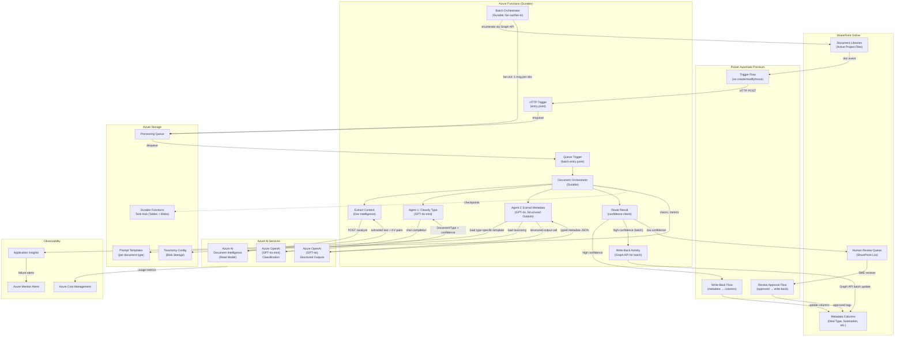
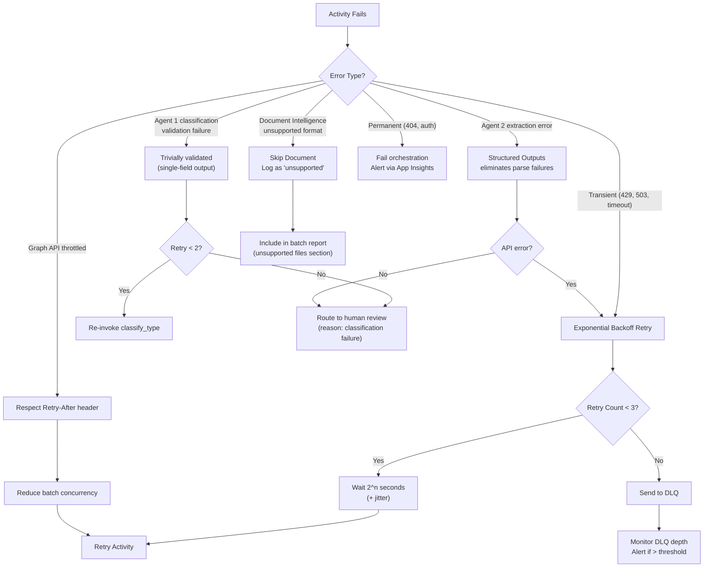

# Pipeline Design — Deep Dive

## 1. End-to-End Architecture



## 2. Component Responsibilities

### Azure Functions — Orchestration Engine

| Function | Type | Responsibility |
|----------|------|---------------|
| `http_trigger` | HTTP Trigger | Entry point for Power Automate trigger-mode calls. Validates payload, enqueues document for processing |
| `queue_trigger` | Queue Trigger | Picks up documents from processing queue, starts orchestrator |
| `document_orchestrator` | Durable Orchestrator | Sequences the extract → classify type → extract metadata → route pipeline for a single document. Handles retries, timeouts, compensation |
| `batch_orchestrator` | Durable Orchestrator | Enumerates SharePoint library, fans-out documents to queue, tracks overall progress, produces batch report |
| `extract_content` | Durable Activity | Calls Azure AI Document Intelligence Read API, polls for result, returns normalized text + key-value pairs |
| `classify_type` | Durable Activity | **Agent 1 (Classifier).** Calls GPT-4o-mini, returns DocumentType + confidence + reasoning. Cheap, fast first pass to determine document type |
| `extract_metadata` | Durable Activity | **Agent 2 (Extractor).** Loads type-specific prompt template + taxonomy based on Agent 1's output, calls GPT-4o with Structured Outputs, returns common fields + type-specific fields + suggested additional fields |
| `route_result` | Durable Activity | Evaluates confidence on both type classification (Agent 1) and per-field extraction (Agent 2), routes to write-back (high confidence) or human review queue (low confidence) |
| `write_metadata` | Durable Activity | Writes classification metadata to SharePoint columns via Microsoft Graph API (used in batch mode) |
| `generate_batch_report` | Durable Activity | Produces batch-tagging results report (coverage, confidence distribution, review queue metrics) |

### Power Automate Premium — Glue Layer

| Flow | Trigger | Responsibility |
|------|---------|---------------|
| `Document-Created-Modified` | SharePoint: When a file is created or modified | Detects new/modified documents, calls HTTP trigger on Azure Function with document URL and metadata |
| `Write-Back-Metadata` | HTTP request (called by Azure Function) | Receives classified metadata from Azure Function, writes to SharePoint list item columns |
| `Review-Approved` | SharePoint: When an item is modified (review list) | Detects when reviewer approves/corrects an item, writes final tags to document's SharePoint columns |

### Azure AI Document Intelligence

- **Model:** Prebuilt Read model (upgrade to Layout if table extraction needed)
- **API Version:** 2024-11-30 (GA)
- **Input:** Document URL or binary content
- **Output:** Extracted text (pages, lines, words), key-value pairs, language detection
- **Rate limit:** 15 requests/sec (S0 tier)

### Azure OpenAI

#### Agent 1 — Classifier (GPT-4o-mini)

- **Model:** GPT-4o-mini
- **API:** Chat Completions
- **Input:** System prompt (document type taxonomy) + user prompt (extracted document text)
- **Output:** DocumentType + confidence + reasoning (single-field classification)
- **Rate limit:** Varies by deployment (request TPM increase for batch)
- **Cost note:** ~10× cheaper than GPT-4o; handles the high-volume classification pass

#### Agent 2 — Extractor (GPT-4o)

- **Model:** GPT-4o
- **API:** Chat Completions with Structured Outputs (`response_format: { type: "json_schema" }`)
- **Input:** Type-specific system prompt (loaded per document type from Blob Storage) + taxonomy + extracted document text
- **Output:** Common fields (deal type, submarket, counterparty, confidentiality) + type-specific fields + suggested additional fields, each with per-field confidence and reasoning
- **Rate limit:** Varies by deployment (request TPM increase for batch)
- **Schema:** Different JSON schema per document type, enforced by Structured Outputs (eliminates parse failures)

## 3. Data Contracts

### Queue Message (Processing Queue)

```json
{
  "documentId": "string (SharePoint item ID)",
  "siteId": "string (SharePoint site ID)",
  "driveId": "string (SharePoint drive ID)",
  "itemId": "string (SharePoint item ID)",
  "fileName": "string",
  "fileUrl": "string (download URL)",
  "contentType": "string (MIME type)",
  "modifiedDateTime": "string (ISO 8601)",
  "source": "trigger | batch",
  "batchId": "string | null (for batch tracking)",
  "attemptNumber": 1
}
```

### Type Classification Result (Agent 1)

```json
{
  "documentType": "Lease Agreement",
  "confidence": 0.94,
  "reasoning": "Document contains lease terms, rental rate schedules, and tenant/landlord signature blocks"
}
```

### Metadata Extraction Result (Agent 2)

```json
{
  "dealType": {"value": "Lease", "confidence": 0.92, "reasoning": "..."},
  "submarket": {"value": "Northwest Houston", "confidence": 0.88, "reasoning": "..."},
  "counterparty": {"value": "CBRE", "confidence": 0.95, "reasoning": "..."},
  "confidentiality": {"value": "Confidential", "confidence": 0.78, "reasoning": "..."},
  "typeSpecificFields": {
    "tenant": {"value": "Acme Corp", "confidence": 0.96, "reasoning": "Named in lease header"},
    "landlord": {"value": "Houston Properties LLC", "confidence": 0.91, "reasoning": "..."},
    "leaseTerm": {"value": "5 years", "confidence": 0.89, "reasoning": "..."},
    "rentalRate": {"value": "$24.50/SF NNN", "confidence": 0.87, "reasoning": "..."},
    "squareFootage": {"value": "15,000 SF", "confidence": 0.93, "reasoning": "..."},
    "commencementDate": {"value": "2026-09-01", "confidence": 0.85, "reasoning": "..."}
  },
  "suggestedFields": [
    {"key": "parkingRatio", "value": "4:1,000 SF", "confidence": 0.82},
    {"key": "renewalOptions", "value": "Two 5-year options", "confidence": 0.79}
  ]
}
```

### Human Review Queue Item (SharePoint List)

| Column | Type | Description |
|--------|------|-------------|
| Title | Text | File name |
| DocumentLink | URL | Link to original document in SharePoint |
| DocumentId | Text | SharePoint item ID |
| DocumentType | Choice | Agent 1 classified document type |
| TypeConfidence | Number | Agent 1 type classification confidence |
| ProposedDealType | Choice | AI-proposed deal type |
| ProposedSubmarket | Choice | AI-proposed submarket |
| ProposedCounterparty | Text | AI-proposed counterparty |
| ProposedConfidentiality | Choice | AI-proposed confidentiality level |
| TypeSpecificFields | Multi-line text | JSON of type-specific extracted fields with per-field confidence |
| SuggestedFields | Multi-line text | JSON of AI-suggested additional fields |
| ConfidenceScores | Multi-line text | JSON of per-field confidence scores |
| LowConfidenceFields | Multi-line text | Fields that triggered review |
| AIReasoning | Multi-line text | AI's reasoning for type classification and each extracted field |
| ReviewStatus | Choice | Pending / Approved / Corrected / Rejected |
| ReviewedBy | Person | SME who reviewed |
| ReviewedDate | DateTime | When reviewed |
| CorrectionNotes | Multi-line text | What was changed and why (for prompt tuning) |
| BatchId | Text | Batch ID if from batch processing |

## 4. Error Handling & Retry Strategy



### Retry Policies by Activity

| Activity | Max Retries | Backoff | First Retry Interval | Timeout |
|----------|------------|---------|---------------------|---------|
| `extract_content` | 3 | Exponential | 5 sec | 120 sec |
| `classify_type` | 3 | Exponential | 3 sec | 30 sec |
| `extract_metadata` | 3 | Exponential | 3 sec | 60 sec |
| `route_result` | 2 | Fixed | 2 sec | 30 sec |
| `write_metadata` | 3 | Exponential | 5 sec | 30 sec |

## 5. Observability

### Application Insights Custom Metrics

| Metric | Type | Description |
|--------|------|-------------|
| `documents.processed` | Counter | Total documents processed (tagged: source=trigger|batch, result=success|review|failed) |
| `documents.extraction.duration` | Histogram | Document Intelligence call duration |
| `documents.classification.duration` | Histogram | Agent 1 (Classifier) call duration |
| `documents.extraction.metadata.duration` | Histogram | Agent 2 (Extractor) call duration |
| `documents.classification.confidence` | Histogram | Agent 1 type classification confidence |
| `documents.metadata.field.confidence` | Histogram | Agent 2 per-field extraction confidence |
| `documents.metadata.suggested_fields.count` | Counter | Number of suggested additional fields discovered by Agent 2 |
| `documents.review.queue.depth` | Gauge | Current human review queue depth |
| `documents.batch.progress` | Gauge | Batch completion percentage |
| `documents.cost.extraction` | Counter | Estimated Document Intelligence cost |
| `documents.cost.classification` | Counter | Estimated GPT-4o-mini token cost (Agent 1) |
| `documents.cost.metadata_extraction` | Counter | Estimated GPT-4o token cost (Agent 2) |

### Alerts

| Alert | Condition | Severity | Action |
|-------|-----------|----------|--------|
| High failure rate | >10% failures in 15 min window | Critical | Page on-call |
| Review queue growing | Queue depth >100 items | Warning | Notify SME team |
| Rate limit sustained | >5 min of continuous 429s | Warning | Reduce concurrency |
| Batch stalled | No progress for >30 min | Critical | Investigate |
| Cost threshold | Daily spend >$200 | Warning | Review and potentially pause |

## 6. Security

- **Authentication:** Azure Functions use Managed Identity to call Document Intelligence, OpenAI, and Graph API
- **SharePoint access:** Application permissions (Sites.ReadWrite.All) scoped to specific site collections via Sites.Selected
- **Secrets:** Connection strings and API keys stored in Azure Key Vault, referenced via App Configuration
- **Network:** Azure Functions on Premium plan with VNet integration (if required by client security posture)
- **Data in transit:** All API calls over HTTPS/TLS 1.2+
- **Data at rest:** Document content is transient (not persisted in pipeline storage); only metadata flows through
- **RBAC:** Separate roles for pipeline admin (deploy, configure) and taxonomy admin (update categories)
