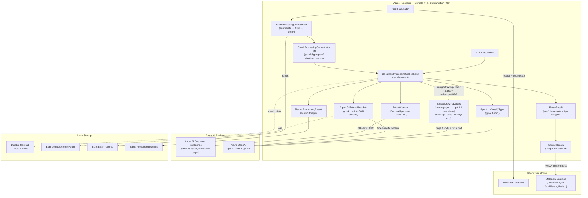
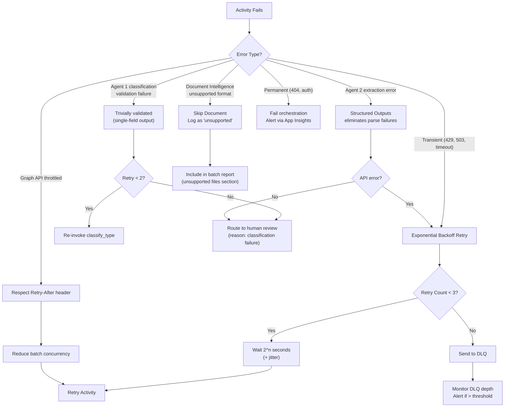

# Pipeline Design — Technical Reference

> ⚠️ **PARTIALLY STALE** — the Mermaid diagram and activity table were updated 2026-08-27 to reflect the
> drawing vision path and current model names. Sections 3–7 (XLSX branch, batch design, taxonomy,
> observability, data contracts) contain pre-v4 field names and types — see [taxonomy.yaml](../taxonomy/taxonomy.yaml)
> for current configuration.

_Last updated: 2026-08-19. Reflects implemented code on branch `xlsx-native-parsing`._

---

## 1. End-to-End Architecture



## 2. Component Responsibilities

### Orchestrators

| Function | Type | Responsibility |
|---|---|---|
| `BatchProcessingOrchestrator` | Durable Orchestrator | Resolves SP target, enumerates library, filters processed, splits into chunks of `BatchChunkSize` (default 500), fans all chunks out in parallel via `Task.WhenAll`. History bounded to ~200 entries for 100K docs. |
| `ChunkProcessingOrchestrator` | Durable Orchestrator | Receives a slice of documents. Processes them in parallel groups of `BatchMaxConcurrency` (default 10) via `Task.WhenAll`. Returns `ChunkResult` — slim `BatchDocumentEntry` projections (DocumentType + RoutingDecision only, no extracted text — avoids OOM at aggregation). |
| `DocumentProcessingOrchestrator` | Durable Orchestrator | Sequences the full pipeline for a single document: GetDownloadUrl → ExtractContent → ClassifyType → confidence gate → ExtractMetadata → RouteResult → WriteMetadata → RecordProcessingResult. All activities retry 3× with exponential backoff. |

### Activities

| Function | Responsibility |
|---|---|
| `GetDocumentDownloadUrl` | Resolves pre-authenticated download URL via Graph API. Passes through non-SharePoint URLs (test mode). |
| `ExtractContent` | **Branches on file extension.** `.xlsx`/`.xlsm` → ClosedXML markdown serialization. `.xls`/`.xlsb` → UnsupportedFormat sentinel. All other formats → Azure AI Document Intelligence (`prebuilt-layout`, Markdown output). |
| `ClassifyType` | **Agent 1 (GPT-4o-mini).** Renders `ClassifyType.hbs` + `UserDocument.hbs` with taxonomy and truncated text (4K chars). Returns `DocumentType`, `Confidence`, `Reasoning`. |
| `ExtractDrawingDetails` | **Drawing vision (gpt-4.1-mini multimodal).** Downloads PDF, renders page 1 to PNG via Docnet.Core + SkiaSharp, sends page image + OCR text to gpt-4.1-mini. Returns `discipline`, `sheetNumber`, `drawingTitle` with confidence. Fires for `DesignDrawing`, `Plat`, `Survey` types and low-text PDFs. Gracefully skipped on render failure. |
| `GetTypeConfidenceThreshold` | Looks up per-type confidence threshold from taxonomy. |
| `ExtractMetadata` | **Agent 2 (GPT-4o Structured Outputs).** Renders `ExtractMetadata.hbs` with type-specific fields from taxonomy. Builds JSON schema dynamically via `MetadataSchemaBuilder`. Returns common fields + type-specific fields + suggested fields, each with value/confidence/reasoning. |
| `RouteResult` | Evaluates per-field confidence against taxonomy thresholds. Sets routing decision (`Write`/`Review`). Emits `DocumentEnriched` custom event to App Insights. |
| `WriteMetadata` | Writes metadata to SharePoint via `PATCH /drives/{driveId}/items/{itemId}/listItem/fields`. |
| `RecordProcessingResult` | Writes `"success"` or `"review"` to Azure Table Storage tracking table. Used by FilterProcessed to skip re-processing. |
| `ResolveSharePointTarget` | Parses SharePoint URL into siteId + driveId + optional folderPath via Graph API. |
| `EnumerateLibrary` | Paginated Graph API query across all subfolders. Filters to: `.pdf`, `.docx`, `.doc`, `.xlsx`, `.xlsm`, `.pptx`, `.txt`. |
| `FilterProcessed` | Drops documents already in the Table Storage tracking table. |
| `GenerateBatchReport` | Aggregates `BatchDocumentEntry` list into counts by routing decision and document type. Writes `BatchReport` JSON to Blob Storage. |

### Shared Utilities

| Class | Responsibility |
|---|---|
| `TaxonomyLoader` | Loads `taxonomy.yaml` from Blob Storage (or local path for dev) and caches via `Lazy<Task<TaxonomyData>>`. |
| `PromptRenderer` | Compiles Handlebars templates (embedded resources) at startup. Renders `ClassifyType.hbs`, `ExtractMetadata.hbs`, `UserDocument.hbs`. |
| `MetadataSchemaBuilder` | Builds GPT-4o Structured Output JSON schema dynamically from taxonomy field definitions. Schema updates when taxonomy changes — no code change needed. |
| `SpreadsheetExtractor` | ClosedXML-based XLSX/XLSM parser. 50 MB size guard. Serializes each worksheet as a Markdown table with sheet-name header. |
| `TextUtils` | Page-aware text truncation using `<!-- PageBreak -->` markers, falling back to sentence boundary, then hard cut. |
| `PdfPageRenderer` | Renders first page of a PDF to a PNG byte array using Docnet.Core (libpdfium) + SkiaSharp. Thread-safe via static lock (Docnet singleton is not thread-safe). Max resolution: 1568×2048 px. |

### Entry Points (HTTP Triggers)

| Endpoint | Mode | Notes |
|---|---|---|
| `POST /api/enrich` | Trigger | Checks `AIProcessingStatus` via Graph API — skips `Classified`/`Reviewed` documents. Deterministic instance ID: `trigger:{siteId}:{itemId}:{modifiedDateTime}`. |
| `POST /api/batch` | Batch | Validates URL, schedules `BatchProcessingOrchestrator`. Accepts optional `maxConcurrency` and `chunkSize` overrides. |

---

## 3. Content Extraction — XLSX Branch

Azure AI Document Intelligence accepts `.xlsx` but flattens structure into unstructured text, discarding sheet boundaries, headers, and formula-evaluated values. For financial workbooks (pro formas, rent rolls, T-12s) this produces low-confidence extractions. See [ADR-007](../decisions/adr-007-xlsx-native-parsing.md).

**Extension-based routing in `ExtractContentActivity`:**

| Extension | Handler | Rationale |
|---|---|---|
| `.xlsx`, `.xlsm` | ClosedXML | Preserves sheet names, headers, formula-evaluated values as Markdown tables |
| `.xls`, `.xlsb` | UnsupportedFormat sentinel | Binary formats not readable by ClosedXML — route to human review |
| All other formats | Document Intelligence | PDF, DOCX, PPTX, TXT — unchanged path |

**ClosedXML output format:**

```markdown
## Sheet: Pro Forma

| Item | Year 1 | Year 2 | Year 3 |
|---|---|---|---|
| Gross Revenue | $1,250,000 | $1,312,500 | $1,378,125 |
...

## Sheet: Assumptions
...
```

This markdown flows into Agent 1 and Agent 2 unchanged — the downstream contract is already Markdown from the Doc Intelligence path.

**Known limitation:** complex workbooks with merged cells or spatial layouts may still produce low-confidence extractions. The `extractionMethod` field in App Insights telemetry enables comparison. Escalation path: Azure AI Foundry agent with Code Interpreter. See ADR-007.

---

## 4. Batch Scale Design

Designed for 100K+ documents. Durable Functions orchestration history is bounded at two levels.

```
BatchProcessingOrchestrator  (1 instance)
  History: ~200 entries  (100K ÷ chunkSize 500)
  │
  └── ChunkProcessingOrchestrator ×200  (all in parallel, Task.WhenAll)
        History: ≤500 entries per chunk
        │
        └── DocumentProcessingOrchestrator ×10  (parallel group, Task.WhenAll)
```

**Configuration:**

| Setting | Default | Description |
|---|---|---|
| `BatchChunkSize` | 500 | Documents per chunk orchestrator |
| `BatchMaxConcurrency` | 10 | Parallel docs per group within a chunk |
| Effective throughput ceiling | ~100 docs/min | GPT-4o TPM quota at 300K TPM — not concurrency |

**Why not queue-triggered functions?** Durable activity replay means only the failed step retries — not the full pipeline including the paid Agent 1 call. Over 100K documents this matters.

---

## 5. Taxonomy — Config-Driven Design

`docs/taxonomy/taxonomy.yaml` (deployed to `{storage}/config/taxonomy.yaml`) is the single source of truth for document types, field schemas, and confidence thresholds. Cached in-memory on startup via `Lazy<Task<TaxonomyData>>`.

**To add a new document type:**
1. Add entry to `taxonomy.yaml`
2. Add to `DocumentType` enum in `Pipeline.cs` — the one required code change
3. Upload updated taxonomy to Blob Storage
4. Restart Function App (`az functionapp restart`)

**To add/change fields or thresholds:** update taxonomy only — no code change. `MetadataSchemaBuilder` generates the GPT-4o schema dynamically.

---

## 6. Observability — App Insights Custom Events

`RouteResult` emits `DocumentEnriched` per document. All events captured at 100% (excluded from sampling in `host.json`).

**Fixed properties:** `documentType`, `routingDecision`, `extractionMethod`, `source`, `batchId`, `fileName`

**Fixed metrics:** `typeConfidence`, `dealTypeConfidence`, `submarketConfidence`, `counterpartyConfidence`, `confidentialityConfidence`, `pageCount`, `textLength`

**Dynamic metrics** (adapts to taxonomy automatically): `field_{name}_confidence` for every type-specific field returned by Agent 2.

**Example KQL:**

```kusto
// Average confidence by document type
customEvents
| where name == "DocumentEnriched"
| summarize
    avgConfidence = avg(todouble(customMeasurements.typeConfidence)),
    reviewRate = countif(tostring(customDimensions.routingDecision) == "Review") * 100.0 / count()
  by documentType = tostring(customDimensions.documentType)
| order by avgConfidence asc

// Extraction method breakdown
customEvents
| where name == "DocumentEnriched"
| summarize count() by tostring(customDimensions.extractionMethod)
```

---

## 7. Data Contracts

### QueueMessage

```json
{
  "documentId": "string (SharePoint item ID)",
  "siteId": "string (SharePoint site ID)",
  "driveId": "string (SharePoint drive ID)",
  "itemId": "string (SharePoint item ID)",
  "fileName": "string",
  "fileUrl": "string (download URL)",
  "contentType": "string (MIME type)",
  "modifiedDateTime": "string (ISO 8601)",
  "source": "trigger | batch",
  "batchId": "string | null (for batch tracking)",
  "attemptNumber": 1
}
```

### Type Classification Result (Agent 1)

```json
{
  "documentType": "Lease Agreement",
  "confidence": 0.94,
  "reasoning": "Document contains lease terms, rental rate schedules, and tenant/landlord signature blocks"
}
```

### Metadata Extraction Result (Agent 2)

```json
{
  "dealType": {"value": "Lease", "confidence": 0.92, "reasoning": "..."},
  "submarket": {"value": "Northwest Houston", "confidence": 0.88, "reasoning": "..."},
  "counterparty": {"value": "CBRE", "confidence": 0.95, "reasoning": "..."},
  "confidentiality": {"value": "Confidential", "confidence": 0.78, "reasoning": "..."},
  "typeSpecificFields": {
    "tenant": {"value": "Acme Corp", "confidence": 0.96, "reasoning": "Named in lease header"},
    "landlord": {"value": "Houston Properties LLC", "confidence": 0.91, "reasoning": "..."},
    "leaseTerm": {"value": "5 years", "confidence": 0.89, "reasoning": "..."},
    "rentalRate": {"value": "$24.50/SF NNN", "confidence": 0.87, "reasoning": "..."},
    "squareFootage": {"value": "15,000 SF", "confidence": 0.93, "reasoning": "..."},
    "commencementDate": {"value": "2026-09-01", "confidence": 0.85, "reasoning": "..."}
  },
  "suggestedFields": [
    {"key": "parkingRatio", "value": "4:1,000 SF", "confidence": 0.82},
    {"key": "renewalOptions", "value": "Two 5-year options", "confidence": 0.79}
  ]
}
```

### Inline Review (Low-Confidence Documents)

Low-confidence documents receive the same metadata columns as high-confidence documents, with `AIProcessingStatus = "Under Review"`. SMEs review via a filtered library view. See [ADR-006](../decisions/adr-006-inline-review.md).

## 8. Error Handling & Retry Strategy



### Retry Policies by Activity

| Activity | Max Retries | Backoff | First Retry Interval | Timeout |
|----------|------------|---------|---------------------|---------|
| `extract_content` | 3 | Exponential | 5 sec | 120 sec |
| `classify_type` | 3 | Exponential | 3 sec | 30 sec |
| `extract_metadata` | 3 | Exponential | 3 sec | 60 sec |
| `route_result` | 2 | Fixed | 2 sec | 30 sec |
| `write_metadata` | 3 | Exponential | 5 sec | 30 sec |

## 9. Security

| Concern | Implementation |
|---|---|
| Azure resource access | System-assigned Managed Identity with RBAC: Cognitive Services OpenAI User, Cognitive Services User, Storage Blob Data Owner, Storage Queue/Table Contributor, Key Vault Secrets User |
| SharePoint access | Graph API application permission `Sites.ReadWrite.All` granted to Managed Identity via `Grant-GraphPermissions.ps1` (requires tenant Global Administrator) |
| Local development | `DefaultAzureCredential` falls back to Azure CLI token (`az login`) — no secrets in code |
| Macro-enabled workbooks | ClosedXML reads XML parts only — VBA is never loaded or executed |
| Corrupt/malformed files | Caught (`InvalidDataException`, `IOException`, `XmlException`) and routed to review — never thrown as unhandled exceptions |
| Secrets | No secrets in code; all endpoints injected as app settings by Bicep from resource outputs |

---

## 10. Not Yet Implemented

| Item | Notes |
|---|---|
| Power Automate flows | Trigger flow + write-back flow — human-only work (tasks 4.2, 4.3) |
| Multi-site trigger strategy | 10 sites in scope; polling vs webhook decision pending client input on latency requirements |
| SharePoint column provisioning | `Provision-SharePointSchema.ps1` — deferred until taxonomy sessions finalize field set |
| Content type provisioning | Planned with PnP PowerShell; deferred until schema is stable |
| Unit + integration tests | No test project exists yet |
| Prompt tuning | Requires real documents and SME evaluation samples (tasks 2.17–2.19) |
