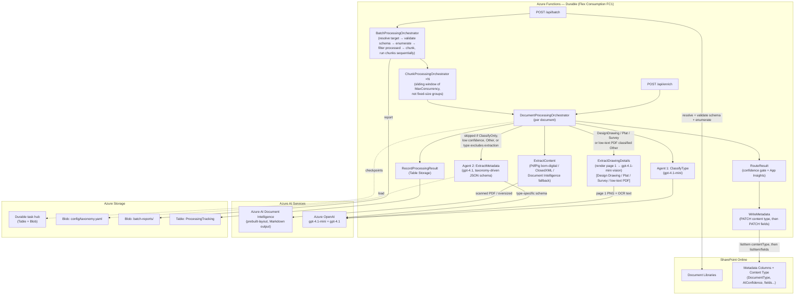

# Pipeline Design — Technical Reference

_Last updated: 2026-09-18. Verified line-by-line against the current codebase (`BatchOrchestrator.cs`,
`DocumentOrchestrator.cs`, `ChunkOrchestrator.cs`, `RouteResultActivity.cs`, `EnumerateLibraryActivity.cs`,
`PipelineSettings.cs`, `taxonomy.yaml` v4) rather than assumed current from an earlier pass._

For day-to-day operation, configuration, and troubleshooting, see the runbooks instead of this document:
[operations](../runbook-operations.md), [configuration](../runbook-configuration.md),
[provisioning](../runbook-provisioning.md), [failures](../runbook-failures.md),
[metadata reference](../runbook-metadata.md). This document is the architectural "how it fits together,"
not the operational "how to run it."

---

## 1. End-to-End Architecture



## 2. Component Responsibilities

### Orchestrators

| Function | Type | Responsibility |
|---|---|---|
| `BatchProcessingOrchestrator` | Durable Orchestrator | Resolves the SharePoint target, runs `ValidateSharePointSchema` (aborts immediately if a required Choice value is missing — see [runbook-provisioning.md](../runbook-provisioning.md)), enumerates the library, filters already-processed documents, splits into chunks of `BatchChunkSize` (default 500), and runs chunks **sequentially** — each chunk sub-orchestration re-applies `MaxConcurrency` internally, so running chunks in parallel would multiply it. |
| `ChunkProcessingOrchestrator` | Durable Orchestrator | Receives a slice of documents and processes them under a **sliding window** bounded by `MaxConcurrency` (default 10): a new document starts the moment any in-flight slot frees up, rather than waiting for a fixed-size group to finish. A wedged or slow document only ever occupies its own slot (bounded by a 20-minute per-document timeout), not the rest of the chunk. Returns a `ChunkResult` — results, error count, failed-document list, and low-confidence classification entries. |
| `DocumentProcessingOrchestrator` | Durable Orchestrator | Sequences the full pipeline for a single document — see the diagram above for the exact branch points (extraction sentinels, drawing vision override, extraction-policy skip, `ClassifyOnly`). |

### Activities

| Function | Responsibility |
|---|---|
| `ValidateSharePointSchema` | Reads the target library's own Choice columns and aborts the batch before any document is touched if a required value (taxonomy-derived or the `DocumentType` enum) is missing. |
| `GetDocumentDownloadUrl` | Resolves a pre-authenticated download URL via Graph API; converts `.docx`/`.pptx` to PDF first when possible (free born-digital extraction instead of a paid Document Intelligence call). Passes non-SharePoint URLs through unchanged (test mode). |
| `ExtractContent` | Branches by file type: spreadsheets → `SpreadsheetExtractor` (ClosedXML); PDFs try local `PdfPig` parsing first and fall back to Document Intelligence only if the PDF is scanned, oversized, or unparseable; plain text is read directly; everything else goes to Document Intelligence. See [runbook-failures.md](../runbook-failures.md) for the full routing logic and its failure modes — it's more branching than this row alone can convey. |
| `ClassifyType` | **Agent 1 (`gpt-4.1-mini`).** Renders `ClassifyType.hbs` + `UserDocument.hbs` with the taxonomy and truncated text. Returns `DocumentType`, `Confidence`, `Reasoning`, optional `Candidates` (alternatives Agent 1 considered), and `UnrecognizedType` (the model's raw wording when its pick fell outside the taxonomy). No Durable-level retry — OpenAI transient failures are already retried inside `OpenAiRetryHelper`. |
| `GetTypeConfidenceThreshold` | Looks up the per-type confidence threshold from the taxonomy. |
| `ExtractDrawingDetails` | **Drawing vision (`gpt-4.1-mini`, multimodal).** Renders page 1 to PNG and sends it with OCR text to the model. Returns `discipline`, `sheetNumber`, `drawingTitle`, `confidence`, and a `drawingType` used to override Agent 1's pick (fill-in when Agent 1 said `Other`; correction when Agent 1 landed elsewhere in the Plat/Survey/Design Drawing family, at a higher confidence bar). Fires for `DesignDrawing`/`Plat`/`Survey`, or any low-text (<500 chars) PDF classified `Other`. Failure here is caught and logged — the document proceeds without vision enrichment rather than failing. |
| `GetTypeExtractionPolicy` | Looks up whether Agent 2 runs at all for this document type (`taxonomy.yaml`'s `ExtractionEnabled`, `true` unless a type opts out — Design Drawing today). |
| `ExtractMetadata` | **Agent 2 (`gpt-4.1`, Structured Outputs).** Renders `ExtractMetadata.hbs` with the taxonomy's content fields. Returns each field's value/confidence/reasoning plus any `suggestedFields` Agent 2 found outside the schema. Skipped entirely when `ClassifyOnly`, confidence is below threshold, the type is `Other`, or the type's extraction policy excludes it. |
| `RouteResult` | Evaluates per-field confidence against taxonomy thresholds, sets the routing decision (`Write`/`Review`), and emits the `DocumentEnriched` custom event to App Insights — see the sampling caveat under "Observability" below. |
| `WriteMetadata` | Two Graph PATCHes in order: `listItem.contentType` first (silently skipped, not failed, if the taxonomy `group` doesn't resolve to a provisioned content type — see [runbook-provisioning.md](../runbook-provisioning.md)), then `listItem/fields` for every column. A field-PATCH failure fails the whole document's metadata, not just that field — see [runbook-provisioning.md, "Why a missing choice value is worse than it looks"](../runbook-provisioning.md#why-a-missing-choice-value-is-worse-than-it-looks). |
| `RecordProcessingResult` | Writes a terminal status (`success`, `review`, `write-back-failed`, `classified-only`, or `error`) to the tracking table, used by `FilterProcessed` to skip re-processing on a later run. |
| `ResolveSharePointTarget` | Parses a SharePoint URL into `siteId` + `driveId` + optional folder path via Graph API. |
| `EnumerateLibrary` | Paginated Graph API query across all subfolders. Filters to `.pdf`, `.docx`, `.xlsx`, `.xlsm`, `.pptx`, `.txt`, skipping Office lock files (`~$...`). |
| `FilterProcessed` | Drops documents already in the tracking table. |
| `GenerateBatchReport` | Aggregates chunk results into counts by routing decision, document type, and confidence distribution; writes the `BatchReport` JSON (and HTML) to blob storage. |

### Shared Utilities

| Class | Responsibility |
|---|---|
| `TaxonomyLoader` | Loads `taxonomy.yaml` (blob or local path) and caches it per app instance via `Lazy<Task<TaxonomyData>>` — a taxonomy edit needs a Function App restart to take effect. |
| `PromptRenderer` | Compiles Handlebars templates (embedded resources) at startup. A `.hbs` edit needs a rebuild, not just a restart. |
| `SpreadsheetExtractor` | ClosedXML-based XLSX/XLSM parser; truncates to a 24K character budget favouring priority sheets rather than rejecting large workbooks outright. |
| `TextUtils` | Page-aware text truncation for the classification/extraction prompts. |
| `PdfPageRenderer` | Renders a PDF page to PNG for the drawing-vision path. |
| `DownloadRetryHelper` | Retries the document's own HTTP download (not the Document Intelligence call) on transient failures — see [runbook-failures.md](../runbook-failures.md) for exactly what it does and doesn't cover. |
| `OpenAiRetryHelper` | Retries Azure OpenAI calls on 429/transient failures with `Retry-After` backoff — the reason `ClassifyType` and `ExtractMetadata` don't also carry a Durable-level retry. |
| `SdkExceptionHelper` | Translates Graph/Azure SDK exceptions into a message carrying the real HTTP status/error code before they cross the activity boundary as an opaque `TaskFailedException`. |

### Entry Points (HTTP Triggers)

| Endpoint | Mode | Notes |
|---|---|---|
| `POST /api/enrich` | Trigger | Single document from SharePoint (event-driven). |
| `POST /api/test/enrich` | Test | Single document by direct blob URL — bypasses SharePoint entirely; write-back is expected to fail in this mode. |
| `POST /api/batch` | Batch | Whole library or a single folder. Accepts `maxConcurrency`, `chunkSize`, `label`, `classifyOnly`, `maxPages`, `itemIds` (re-run a specific set of documents). |

---

## 3. Content Extraction — Spreadsheet Branch

Azure AI Document Intelligence accepts `.xlsx` but flattens structure into unstructured text, discarding
sheet boundaries, headers, and formula-evaluated values. For financial workbooks (pro formas, rent rolls,
T-12s) this produces low-confidence extractions. See [ADR-007](../decisions/adr-007-xlsx-native-parsing.md).

| Extension | Handler |
|---|---|
| `.xlsx`, `.xlsm` | ClosedXML — preserves sheet names, headers, formula-evaluated values as Markdown tables |
| Unsupported spreadsheet formats (`.xls`, `.xlsb`) | `UnsupportedFormat` sentinel — routes to Review |
| `.pdf` | Local `PdfPig` parsing when born-digital; Document Intelligence when scanned, oversized, or unparseable locally |
| `.txt` | Read directly |
| Everything else reaching Document Intelligence | `prebuilt-layout`, Markdown output |

This is a summary — the PDF branch in particular has real nuance (size/page caps, `maxPages`, PDF-to-PDF
conversion fallback, password-protected/too-large sentinels). See
[runbook-failures.md](../runbook-failures.md) for the complete routing logic and every known failure mode
in it.

---

## 4. Batch Scale Design

```
BatchProcessingOrchestrator  (1 instance)
  │
  └── ChunkProcessingOrchestrator ×N  (run SEQUENTIALLY — see BatchOrchestrator.cs)
        │
        └── DocumentProcessingOrchestrator × MaxConcurrency  (sliding window, not a fixed group)
```

Chunks run one at a time deliberately: each chunk re-applies `MaxConcurrency` internally, so running
chunks in parallel would multiply real concurrent load against Azure OpenAI far past the configured
number.

**Configuration** (`PipelineSettings` defaults, overridable per-request):

| Setting | Default |
|---|---|
| `BatchChunkSize` | 500 |
| `BatchMaxConcurrency` | 10 |

**Current concurrency guidance is measured, not modeled** — see
[runbook-operations.md, "Throughput and quota"](../runbook-operations.md#throughput-and-quota) for the
actual numbers: 25 validated for full-extraction runs (53.4 docs/min), and for classify-only runs, 80
under ~2,000 documents but dialed back to 40 above that after a real SharePoint download-throttling
failure at scale on 2026-09-18. Both are empirical, not derived from the TPM quota table that used to
live in this document — Durable Functions concurrency and (as of that batch) SharePoint's own download
throttling are the actual constraints, not just Azure OpenAI TPM.

**Why not queue-triggered functions?** Durable activity replay means only the failed step retries — not
the full pipeline including the paid Agent 1/Agent 2 calls already made. Over a large corpus this matters.

---

## 5. Taxonomy — Config-Driven Design

`docs/taxonomy/taxonomy.yaml` is the single source of truth for document types, field schemas, and
confidence thresholds. Cached in-memory per app instance.

**To add a new document type** (needs a code change) or **a new content type** (when a document type
doesn't fit any of the 5 existing groups): see
[runbook-provisioning.md](../runbook-provisioning.md#add-a-new-document-type). In short: `taxonomy.yaml`
→ `Models/Enums.cs` (**not** `Pipeline.cs` — that was wrong in an earlier version of this document) →
`Provision-SharePointSchema.ps1` → rebuild, redeploy, **re-run provisioning**. That last step is easy to
skip and used to fail silently; the provisioning script now converges choice lists on every run, so
re-running is what actually deploys the value to SharePoint.

**To add/change a metadata field or a threshold:** taxonomy only, no code change — see
[runbook-configuration.md](../runbook-configuration.md#add-a-metadata-field-yaml--provisioning-only). For
the full current field list, see [runbook-metadata.md](../runbook-metadata.md).

---

## 6. Observability — App Insights Custom Events

`RouteResult` emits one `DocumentEnriched` event per document.

**Fixed properties:** `documentId`, `fileName`, `documentType`, `routingDecision`, `extractionMethod`,
`source`, `batchId`

**Fixed metrics:** `typeConfidence`, `pageCount`, `textLength`

**Dynamic metrics** (adapts to whatever the taxonomy defines): `field_{name}_confidence` for every
`content.*` field Agent 2 actually returned — e.g. `field_documentStatus_confidence`,
`field_counterparty_confidence` under the current v4 taxonomy, not the v3-era `dealType`/`submarket`/
`confidentiality` names an earlier version of this document listed as fixed metrics.

⚠️ **These events are sampled and not authoritative at scale.** For at least one production batch,
`DocumentEnriched` events were lost **entirely** — zero rows survived for that batchId, while another
batch's events came through complete. See
[runbook-operations.md](../runbook-operations.md#monitoring--troubleshooting) — the Durable Task instance
store, not App Insights, is the reliable source for a full per-document accounting.

---

## 7. Data Contracts

### QueueMessage

```json
{
  "documentId": "string (SharePoint item ID)",
  "siteId": "string (SharePoint site ID)",
  "driveId": "string (SharePoint drive ID)",
  "itemId": "string (SharePoint item ID)",
  "fileName": "string",
  "fileUrl": "string (download URL, or blob URL in test mode)",
  "contentType": "string (MIME type)",
  "modifiedDateTime": "string (ISO 8601)",
  "source": "Trigger | Batch",
  "batchId": "string | null",
  "attemptNumber": 1,
  "classifyOnly": false,
  "maxPages": null
}
```

### Type Classification Result (Agent 1)

```json
{
  "documentType": "PSA - Acquisition",
  "confidence": 0.94,
  "reasoning": "Executed purchase and sale agreement with signature blocks",
  "candidates": [
    {"documentType": "Letter of Intent", "confidence": 0.35}
  ],
  "unrecognizedType": null
}
```

`candidates` is populated only when Agent 1 couldn't confidently settle on one type; `unrecognizedType`
carries the model's raw wording when its primary pick fell outside the taxonomy (before
`TolerantDocumentTypeConverter` coerces it to `Other`).

### Metadata Extraction Result (Agent 2)

Keyed by the taxonomy's `field_name`s directly — there is no separate "type-specific" bucket; a document
type's fields are whichever universal/property/transaction/ownership fields the taxonomy defines (see
[runbook-metadata.md](../runbook-metadata.md) for the current full field list per group):

```json
{
  "fields": {
    "documentStatus": {"value": "Executed", "confidence": 0.95, "reasoning": "Signature blocks present, dated"},
    "counterparty": {"value": "CBRE", "confidence": 0.9, "reasoning": "Named as broker on the cover page"},
    "transactionType": {"value": "Acquisition", "confidence": 0.88, "reasoning": "Purchase and sale agreement"},
    "propertyAddress": {"value": "123 Main St, Fort Worth, TX", "confidence": 0.92, "reasoning": "Stated in the property description"}
  },
  "suggestedFields": [
    {"key": "escrowNumber", "value": "GF-4471209", "confidence": 0.81}
  ]
}
```

### Inline Review (Low-Confidence Documents)

Low-confidence documents receive the same metadata columns as high-confidence documents, with
`AIProcessingStatus = "Under Review"`. Reviewers work from a filtered library view, not a separate list.
See [ADR-006](../decisions/adr-006-inline-review.md).

---

## 8. Error Handling & Retry Strategy

There is no dead-letter queue — a document that fails after retries is recorded with a terminal status
(`error`/`write-back-failed`) in the tracking table and the batch report's `failedDocuments`, and the
batch continues. The retry story is split across three layers, not one uniform policy:

| Layer | Where | What it covers |
|---|---|---|
| Durable activity retry (3 attempts, 5s first interval, ×2.0 backoff) | Most activities (`GetDocumentDownloadUrl`, `GetTypeConfidenceThreshold`, `GetTypeExtractionPolicy`, `RouteResult`, `WriteMetadata`, `RecordProcessingResult`, `ValidateSharePointSchema`) | Whole-activity failures — safe to retry because these activities aren't billable/side-effecting on partial completion |
| Deliberately **no** Durable retry | `ExtractContent`, `ClassifyType`, `ExtractDrawingDetails` | `ExtractContent` submits a **billable** Document Intelligence job — a whole-activity retry risks resubmitting work already accepted and billed. `ClassifyType`/`ExtractDrawingDetails` are pure OpenAI calls already retried internally (below); a second Durable-level retry only compounded worst-case latency. |
| Internal retry inside the activity | `DownloadRetryHelper` (the document's own HTTP download — not Document Intelligence), `OpenAiRetryHelper` (Azure OpenAI calls, `Retry-After`-aware) | Transient failures at the actual network call, distinct from the whole-activity retry above |

See [runbook-failures.md](../runbook-failures.md) for the specific failure signatures this produces in
practice (the Document Intelligence download failure, SharePoint download throttling, Azure OpenAI
content-filter rejections) and what, if anything, can be done about each.

## 9. Security

| Concern | Implementation |
|---|---|
| Azure resource access | System-assigned Managed Identity with RBAC scoped to OpenAI/Document Intelligence/Storage/Key Vault |
| SharePoint access | Graph API application permission `Sites.ReadWrite.All` granted via `Grant-GraphPermissions.ps1` (requires a tenant admin) |
| Local development | `DefaultAzureCredential` falls back to the Azure CLI token (`az login`) — no secrets in code |
| Macro-enabled workbooks | ClosedXML reads XML parts only — VBA is never loaded or executed |
| Corrupt/malformed files | Caught and routed to Review rather than thrown as an unhandled exception — see [runbook-failures.md](../runbook-failures.md) |
| Secrets | No secrets in code; endpoints injected as app settings |

---

## 10. Not Yet Implemented

| Item | Notes |
|---|---|
| Power Automate flows | Trigger flow + write-back flow for the event-driven path — genuinely not built, confirmed 2026-09-18. Design-only; see [architecture/power-automate-integration.md](power-automate-integration.md) (itself stale — pre-v4). |
| Multi-site trigger strategy | Polling vs. webhook decision pending client input on latency requirements — moot until the Power Automate flows above exist |
| Cost reporting in dollars | Token counts are real; dollar-amount pricing constants aren't implemented — see [runbook-failures.md](../runbook-failures.md) |
| Pro forma financial metrics (IRR, yield, NOI) | Deliberately deferred — models vary too much across projects |
| Prompt tuning against a larger, SME-reviewed sample | Ongoing as more real documents and client feedback come in |
