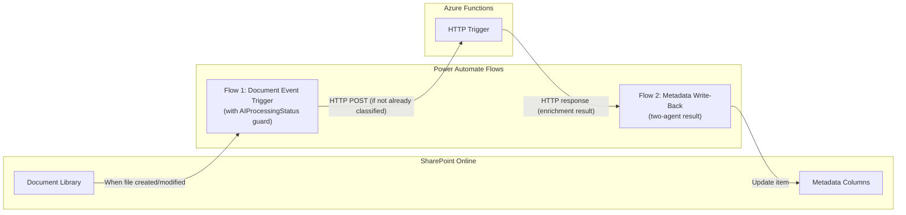

# Power Automate Integration — Deep Dive

> ⚠️ **PARTIALLY STALE** — last substantively updated mid-Aug 2026, before the v4 taxonomy, the drawing
> vision path, and the folder-derived metadata model. The overall architecture is still accurate; specific
> field names, document types, and flows may not be. See [HANDOVER.md](../HANDOVER.md) §4 for what changed,
> and [taxonomy.yaml](../taxonomy/taxonomy.yaml) for the current configuration.

## 1. Flow Architecture Overview

Power Automate serves as the **glue layer** between SharePoint events and the Azure Functions pipeline. It handles two responsibilities:

1. **Event detection** — detects document create/modify/move in SharePoint (with re-trigger guard)
2. **Write-back** (trigger mode) — writes two-agent enrichment results to SharePoint columns

SME review happens inline via a filtered SharePoint library view — no separate review list or approval flow. See [ADR-006](../decisions/adr-006-inline-review.md) for rationale.



## 2. Flow 1: Document Event Trigger

### Purpose
Detects when a document is created, modified, or moved in the target SharePoint libraries and triggers the classification pipeline. Includes re-trigger guard to prevent infinite loops.

### Re-Trigger Guard (R1 Fix)

**Problem:** Writing metadata back to SharePoint fires a new "modified" event, creating an infinite processing loop. The original dedup strategy using `modifiedDateTime` in the instance ID is broken because write-back mutates that field.

**Solution:** Check `AIProcessingStatus` column BEFORE invoking the pipeline. If the column is already set to "Classified" or "Under Review", the file was modified by the pipeline's own write-back — skip it.

### Flow Design

```
Trigger: SharePoint — When a file is created or modified in a folder
    ├── Scope: Target document library (Active Projects)
    │
    ├── Condition: File extension in [.pdf, .docx, .doc, .xlsx, .pptx, .txt]
    │   ├── If No → Terminate (skip unsupported formats)
    │   └── If Yes → Continue
    │
    ├── Condition: File size < 50 MB
    │   ├── If No → Log warning, skip
    │   └── If Yes → Continue
    │
    ├── ⚠️ RE-TRIGGER GUARD: Get file properties → check AIProcessingStatus
    │   ├── Condition: AIProcessingStatus is NOT empty/null
    │   │   ├── If AIProcessingStatus = "Classified" or "Reviewed"
    │   │   │   └── Terminate (already processed — this event was caused by write-back)
    │   │   └── If AIProcessingStatus = "Failed" → Continue (allow retry)
    │   └── If AIProcessingStatus is empty → Continue (new document, never processed)
    │
    ├── Compose: Build request payload
    │   {
    │     "documentId": "@{triggerOutputs()?['body/ID']}",
    │     "siteId": "<site-id>",
    │     "driveId": "<drive-id>",
    │     "itemId": "@{triggerOutputs()?['body/ID']}",
    │     "fileName": "@{triggerOutputs()?['body/{FilenameWithExtension}']}",
    │     "fileUrl": "@{triggerOutputs()?['body/{Link}']}",
    │     "contentType": "@{triggerOutputs()?['body/{ContentType}']}",
    │     "modifiedDateTime": "@{triggerOutputs()?['body/Modified']}",
    │     "source": "trigger",
    │     "batchId": null,
    │     "attemptNumber": 1
    │   }
    │
    ├── HTTP: POST to Azure Function HTTP Trigger
    │   URL: https://<function-app>.azurewebsites.net/api/enrich
    │   Headers: x-functions-key: <function-key>
    │   Body: @{outputs('Compose')}
    │   Timeout: 300 seconds
    │
    ├── Condition: HTTP Status = 200
    │   ├── If Yes → Parse JSON response (EnrichmentResult)
    │   │   ├── Condition: routingDecision = "write"
    │   │   │   ├── If Yes → Update SharePoint item metadata columns (Flow 2 logic inline)
    │   │   │   └── If No → (routed to review queue by Function)
    │   │   └── Log success to audit list
    │   │
    │   ├── If Status = 409 → Log "already processing" (duplicate event)
    │   │
    │   └── If Status = 5xx → Retry (Power Automate built-in retry)
    │
    └── Run after: Handle failures → Log to error list
```

### Key Configuration

| Setting | Value | Rationale |
|---------|-------|-----------|
| Trigger polling interval | 1 minute (default) | Near-real-time, no need for faster |
| Concurrency control | 1 (sequential) | Prevents flooding Azure Function; queue handles parallelism |
| Retry policy | Fixed, 3 retries, 60 sec interval | Handles transient Function App cold starts |
| Timeout | 300 seconds | Two-agent pipeline may take 30-120 seconds |

### Important: Sync vs. Async Pattern

**Option A: Synchronous** (Power Automate waits for enrichment result)
- Simpler flow design
- Power Automate action timeout risk (5 min default)
- Suitable for trigger mode (single document, <2 min processing)

**Option B: Asynchronous** (Power Automate fires-and-forgets, Function writes back independently)
- More resilient
- Requires the Function to call Graph API directly for write-back
- Better for batch mode

**Recommendation:** Synchronous for trigger mode (simpler, within timeout), asynchronous for batch mode (Function writes back via Graph API).

## 3. Flow 2: Metadata Write-Back (Trigger Mode)

### SharePoint Column Mapping

| Enrichment Result Field | SharePoint Column | Column Type | Notes |
|------------------------|-------------------|-------------|-------|
| `typeClassification.documentType` | DocumentType | Choice | Agent 1 classification |
| `metadata.dealType.value` | DealType | Choice | Dropdown with allowed taxonomy values |
| `metadata.submarket.value` | Submarket | Choice | Dropdown with allowed taxonomy values |
| `metadata.counterparty.value` | Counterparty | Single line of text | Free text (company names vary) |
| `metadata.confidentiality.value` | Confidentiality | Choice | Dropdown with allowed taxonomy values |
| `typeClassification.confidence` | AIConfidence | Number | Decimal, 0.00-1.00 (min of Agent 1 + Agent 2) |
| `routingDecision` | AIProcessingStatus | Choice | "Classified" / "Under Review" / "Failed" |
| `metadata.typeSpecificFields` | TypeSpecificFields | Multi-line text | JSON string of type-specific fields |
| `metadata.suggestedFields` | SuggestedFields | Multi-line text | JSON string of suggested fields |
| (serialized enrichment result) | AIOriginalClassification | Multi-line text | JSON snapshot of AI's original output for correction diffing |
| (computed) | AIClassifiedDate | Date/Time | When pipeline ran |

### Write-Back Action

```
Update item: SharePoint — Update file properties
    Site: <target-site>
    Library: Active Projects
    Id: @{triggerOutputs()?['body/ID']}
    
    DocumentType: @{body('Parse_Result')?['typeClassification']?['documentType']}
    DealType: @{body('Parse_Result')?['metadata']?['dealType']?['value']}
    Submarket: @{body('Parse_Result')?['metadata']?['submarket']?['value']}
    Counterparty: @{body('Parse_Result')?['metadata']?['counterparty']?['value']}
    Confidentiality: @{body('Parse_Result')?['metadata']?['confidentiality']?['value']}
    AIConfidence: @{body('Parse_Result')?['typeClassification']?['confidence']}
    AIProcessingStatus: Classified
    TypeSpecificFields: @{string(body('Parse_Result')?['metadata']?['typeSpecificFields'])}
    SuggestedFields: @{string(body('Parse_Result')?['metadata']?['suggestedFields'])}
    AIOriginalClassification: @{string(body('Parse_Result'))}
    AIClassifiedDate: @{utcNow()}
```

**Note on re-trigger prevention:** Setting `AIProcessingStatus = "Classified"` is what causes the re-trigger guard (in Flow 1) to terminate the next time this file's modified event fires. This is the R1 loop breaker.

## 4. SME Review (No Flow 3 — Inline Editing)

The earlier architecture included a separate review queue list and a Power Automate flow to write approved/corrected tags back to documents. This was simplified:

- **Low-confidence documents** get metadata written with `AIProcessingStatus = "Under Review"` (same `write_metadata` activity as high-confidence docs — just a different status value)
- **SMEs review** via a filtered SharePoint library view ("Needs Review" = `AIProcessingStatus = Under Review`)
- **SMEs correct** by editing column values directly on the document, then changing `AIProcessingStatus` to "Reviewed"
- **No separate approval flow** — changes take effect immediately when the SME saves

### Capturing Corrections for Prompt Tuning

Without Flow 3, corrections are captured by comparing current column values against the original AI output. The pipeline stores the original AI classification in the `AIOriginalClassification` column (JSON) at write time. A Python evaluation script (`tests/evaluation/analyze_corrections.py`) queries documents where `AIProcessingStatus = "Reviewed"` and diffs current values against `AIOriginalClassification` to produce the corrections dataset for prompt tuning.

This is a batch analysis step run during prompt tuning iterations — not a real-time flow.

## 5. Power Automate Limitations & Mitigations

| Limitation | Impact | Mitigation |
|-----------|--------|-----------|
| **100K actions/day** (per-user license) | Batch mode with 25K docs × ~5 actions/doc = 125K actions | Use Graph API from Azure Functions for batch write-back; reserve PA actions for trigger mode |
| **5-minute default timeout** | Two-agent pipeline may take 60-120 seconds | Use async pattern for >2 min processing; or increase timeout to 10 min (Premium) |
| **No unit testing** | Can't test flows in CI/CD | Test Azure Functions independently; PA flows tested manually during pilot |
| **Polling trigger (not webhook)** | 1-3 min delay before detection | Acceptable for metadata enrichment use case |
| **Limited error handling** | Retry is basic; no circuit breaker | Critical error handling in Azure Functions; PA only handles happy path + simple retries |
| **Change management** | Flows are managed in maker portal, not Git | Export flows as .zip packages; document flow designs in architecture docs; use solution-aware flows |
| **Re-trigger risk** | Write-back fires new modified event | AIProcessingStatus guard in Flow 1 terminates the loop (see Section 2) |

## 6. Alternative: Direct Graph API (No Power Automate)

For batch mode, and potentially trigger mode in future phases, Azure Functions can bypass Power Automate entirely:

```csharp
// Activities/WriteMetadataActivity.cs

using System.Text.Json;
using IdvEnrichment.Functions.Models;
using Microsoft.Azure.Functions.Worker;
using Microsoft.Graph;
using Microsoft.Graph.Models;

namespace IdvEnrichment.Functions.Activities;

public sealed class WriteMetadataActivity(GraphServiceClient graph)
{
    [Function(nameof(WriteMetadata))]
    public async Task WriteMetadata([ActivityTrigger] WriteMetadataInput input)
    {
        // Snapshot the AI's original output for correction diffing during prompt tuning
        var originalClassification = JsonSerializer.Serialize(new
        {
            input.Result.TypeClassification,
            input.Result.Metadata,
        });

        var fields = new FieldValueSet
        {
            AdditionalData = new Dictionary<string, object>
            {
                ["DocumentType"] = JsonSerializer.Serialize(input.Result.TypeClassification.DocumentType).Trim('"'),
                ["DealType"] = input.Result.Metadata?.DealType.Value ?? "",
                ["Submarket"] = input.Result.Metadata?.Submarket.Value ?? "",
                ["Counterparty"] = input.Result.Metadata?.Counterparty.Value ?? "",
                ["Confidentiality"] = input.Result.Metadata?.Confidentiality.Value ?? "",
                ["AIConfidence"] = input.Result.TypeClassification.Confidence,
                ["AIProcessingStatus"] = input.Result.RoutingDecision == RoutingDecision.Write
                    ? "Classified" : "Under Review",
                ["AIClassifiedDate"] = DateTimeOffset.UtcNow.ToString("o"),
                ["TypeSpecificFields"] = JsonSerializer.Serialize(input.Result.Metadata?.TypeSpecificFields),
                ["SuggestedFields"] = JsonSerializer.Serialize(input.Result.Metadata?.SuggestedFields),
                ["AIOriginalClassification"] = originalClassification,
            },
        };

        await graph.Sites[input.SiteId].Drives[input.DriveId]
            .Items[input.ItemId].ListItem.Fields
            .PatchAsync(fields);
    }
}

public sealed record WriteMetadataInput(
    string SiteId, string DriveId, string ItemId, EnrichmentResult Result);
```

### When to Use Graph API vs. Power Automate

| Scenario | Recommended Approach | Reason |
|----------|---------------------|--------|
| Trigger mode write-back | Power Automate | Simple, auditable, within action limits |
| Batch mode write-back | Graph API from Azure Functions | Volume exceeds PA limits; faster |
| SME correction write-back | Inline in SharePoint | SME edits columns directly; no approval flow needed |
| Event detection | Power Automate | Built-in SharePoint connector; no Graph subscriptions needed |
| Future: High-volume trigger | Graph API + Change Notifications | If document volume exceeds PA capacity |
