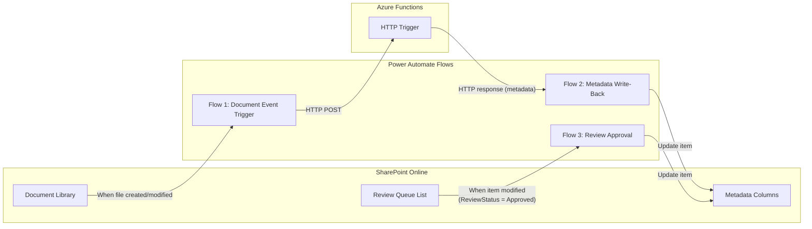

# Power Automate Integration — Deep Dive

## 1. Flow Architecture Overview

Power Automate serves as the **glue layer** between SharePoint events and the Azure Functions pipeline. It handles three responsibilities:

1. **Event detection** — detects document create/modify/move in SharePoint
2. **Write-back** (trigger mode) — writes classification metadata to SharePoint columns
3. **Review approval** — detects when a reviewer approves/corrects a review queue item



## 2. Flow 1: Document Event Trigger

### Purpose
Detects when a document is created, modified, or moved in the target SharePoint libraries and triggers the classification pipeline.

### Flow Design

```
Trigger: SharePoint — When a file is created or modified in a folder
    ├── Scope: Target document library (Active Projects)
    │
    ├── Condition: File extension in [.pdf, .docx, .doc, .xlsx, .pptx, .txt]
    │   ├── If No → Terminate (skip unsupported formats)
    │   └── If Yes → Continue
    │
    ├── Condition: File size < 50 MB
    │   ├── If No → Log warning, skip
    │   └── If Yes → Continue
    │
    ├── Compose: Build request payload
    │   {
    │     "documentId": "@{triggerOutputs()?['body/ID']}",
    │     "siteId": "<site-id>",
    │     "driveId": "<drive-id>",
    │     "itemId": "@{triggerOutputs()?['body/ID']}",
    │     "fileName": "@{triggerOutputs()?['body/{FilenameWithExtension}']}",
    │     "fileUrl": "@{triggerOutputs()?['body/{Link}']}",
    │     "contentType": "@{triggerOutputs()?['body/{ContentType}']}",
    │     "modifiedDateTime": "@{triggerOutputs()?['body/Modified']}",
    │     "source": "trigger",
    │     "batchId": null,
    │     "attemptNumber": 1
    │   }
    │
    ├── HTTP: POST to Azure Function HTTP Trigger
    │   URL: https://<function-app>.azurewebsites.net/api/classify
    │   Headers: x-functions-key: <function-key>
    │   Body: @{outputs('Compose')}
    │   Timeout: 300 seconds
    │
    ├── Condition: HTTP Status = 200
    │   ├── If Yes → Parse JSON response
    │   │   ├── Condition: routingDecision = "write"
    │   │   │   ├── If Yes → Update SharePoint item metadata columns
    │   │   │   └── If No → (routed to review queue by Function)
    │   │   └── Log success to audit list
    │   │
    │   ├── If Status = 409 → Log "already processing" (duplicate event)
    │   │
    │   └── If Status = 5xx → Retry (Power Automate built-in retry)
    │
    └── Run after: Handle failures → Log to error list
```

### Key Configuration

| Setting | Value | Rationale |
|---------|-------|-----------|
| Trigger polling interval | 1 minute (default) | Near-real-time, no need for faster |
| Concurrency control | 1 (sequential) | Prevents flooding Azure Function; queue handles parallelism |
| Retry policy | Fixed, 3 retries, 60 sec interval | Handles transient Function App cold starts |
| Timeout | 300 seconds | Classification pipeline may take 30-90 seconds |

### Important: Sync vs. Async Pattern

**Option A: Synchronous** (Power Automate waits for classification result)
- Simpler flow design
- Power Automate action timeout risk (5 min default)
- Suitable for trigger mode (single document, <2 min processing)

**Option B: Asynchronous** (Power Automate fires-and-forgets, Function writes back independently)
- More resilient
- Requires the Function to call Graph API directly for write-back
- Better for batch mode

**Recommendation:** Synchronous for trigger mode (simpler, within timeout), asynchronous for batch mode (Function writes back via Graph API).

## 3. Flow 2: Metadata Write-Back (Trigger Mode)

### SharePoint Column Mapping

| Classification Field | SharePoint Column | Column Type | Notes |
|---------------------|-------------------|-------------|-------|
| `dealType.value` | DealType | Choice | Dropdown with allowed taxonomy values |
| `submarket.value` | Submarket | Choice | Dropdown with allowed taxonomy values |
| `counterparty.value` | Counterparty | Single line of text | Free text (company names vary) |
| `documentClassification.value` | DocClassification | Choice | Dropdown with allowed taxonomy values |
| `confidentiality.value` | Confidentiality | Choice | Dropdown with allowed taxonomy values |
| `overallConfidence` | AIConfidence | Number | Decimal, 0.00-1.00 |
| `routingDecision` | AIProcessingStatus | Choice | "Classified" / "Under Review" / "Failed" |
| `processingMetrics.totalDurationMs` | AIProcessingTime | Number | Milliseconds |
| (computed) | AIClassifiedDate | Date/Time | When pipeline ran |

### Write-Back Action

```
Update item: SharePoint — Update file properties
    Site: <target-site>
    Library: Active Projects
    Id: @{triggerOutputs()?['body/ID']}
    
    DealType: @{body('Parse_Classification')?['classification']?['dealType']?['value']}
    Submarket: @{body('Parse_Classification')?['classification']?['submarket']?['value']}
    Counterparty: @{body('Parse_Classification')?['classification']?['counterparty']?['value']}
    DocClassification: @{body('Parse_Classification')?['classification']?['documentClassification']?['value']}
    Confidentiality: @{body('Parse_Classification')?['classification']?['confidentiality']?['value']}
    AIConfidence: @{body('Parse_Classification')?['overallConfidence']}
    AIProcessingStatus: Classified
    AIClassifiedDate: @{utcNow()}
```

## 4. Flow 3: Review Approval

### Purpose
When an SME reviews and approves/corrects a human review queue item, this flow writes the final tags to the original document's SharePoint columns.

### Flow Design

```
Trigger: SharePoint — When an item is modified
    ├── List: Human Review Queue
    │
    ├── Condition: ReviewStatus = "Approved" OR ReviewStatus = "Corrected"
    │   ├── If No → Terminate (not a completed review)
    │   └── If Yes → Continue
    │
    ├── Get item: Fetch full review queue item details
    │
    ├── Update item: Update ORIGINAL document metadata
    │   Site: <target-site>
    │   Library: Active Projects
    │   Id: @{triggerOutputs()?['body/DocumentId']}
    │   
    │   DealType: @{triggerOutputs()?['body/ProposedDealType']}
    │   Submarket: @{triggerOutputs()?['body/ProposedSubmarket']}
    │   Counterparty: @{triggerOutputs()?['body/ProposedCounterparty']}
    │   DocClassification: @{triggerOutputs()?['body/ProposedClassification']}
    │   Confidentiality: @{triggerOutputs()?['body/ProposedConfidentiality']}
    │   AIConfidence: @{triggerOutputs()?['body/ConfidenceScores']}
    │   AIProcessingStatus: "Reviewed"
    │   AIClassifiedDate: @{utcNow()}
    │
    ├── Condition: ReviewStatus = "Corrected"
    │   ├── If Yes → Log correction to Corrections List (for prompt tuning)
    │   │   ├── DocumentId, FileName
    │   │   ├── OriginalClassification (AI-proposed)
    │   │   ├── CorrectedClassification (SME-corrected)
    │   │   ├── CorrectionNotes
    │   │   └── CorrectedBy, CorrectedDate
    │   └── If No → Continue
    │
    └── Update review queue item: Set status to "Completed"
```

## 5. Power Automate Limitations & Mitigations

| Limitation | Impact | Mitigation |
|-----------|--------|-----------|
| **100K actions/day** (per-user license) | Batch mode with 25K docs × ~5 actions/doc = 125K actions | Use Graph API from Azure Functions for batch write-back; reserve PA actions for trigger mode |
| **5-minute default timeout** | Long-running classifications may timeout | Use async pattern for >2 min processing; or increase timeout to 10 min (Premium) |
| **No unit testing** | Can't test flows in CI/CD | Test Azure Functions independently; PA flows tested manually during pilot |
| **Polling trigger (not webhook)** | 1-3 min delay before detection | Acceptable for metadata enrichment use case |
| **Limited error handling** | Retry is basic; no circuit breaker | Critical error handling in Azure Functions; PA only handles happy path + simple retries |
| **Change management** | Flows are managed in maker portal, not Git | Export flows as .zip packages; document flow designs in architecture docs; use solution-aware flows |

## 6. Alternative: Direct Graph API (No Power Automate)

For batch mode, and potentially trigger mode in future phases, Azure Functions can bypass Power Automate entirely:

```python
# shared/graph_client.py

from azure.identity import DefaultAzureCredential
from msgraph import GraphServiceClient

async def write_metadata_to_sharepoint(
    site_id: str,
    drive_id: str, 
    item_id: str,
    metadata: dict,
) -> None:
    """Write classification metadata directly to SharePoint via Graph API."""
    
    credential = DefaultAzureCredential()
    client = GraphServiceClient(credential)
    
    # Update list item fields
    fields = {
        "DealType": metadata["dealType"]["value"],
        "Submarket": metadata["submarket"]["value"],
        "Counterparty": metadata["counterparty"]["value"],
        "DocClassification": metadata["documentClassification"]["value"],
        "Confidentiality": metadata["confidentiality"]["value"],
        "AIConfidence": metadata["overallConfidence"],
        "AIProcessingStatus": "Classified",
        "AIClassifiedDate": datetime.utcnow().isoformat(),
    }
    
    await client.sites.by_site_id(site_id) \
        .drives.by_drive_id(drive_id) \
        .items.by_drive_item_id(item_id) \
        .list_item.fields \
        .patch(fields)
```

### When to Use Graph API vs. Power Automate

| Scenario | Recommended Approach | Reason |
|----------|---------------------|--------|
| Trigger mode write-back | Power Automate | Simple, auditable, within action limits |
| Batch mode write-back | Graph API from Azure Functions | Volume exceeds PA limits; faster |
| Review approval write-back | Power Automate | Low volume; easy to build |
| Event detection | Power Automate | Built-in SharePoint connector; no Graph subscriptions needed |
| Future: High-volume trigger | Graph API + Change Notifications | If document volume exceeds PA capacity |
