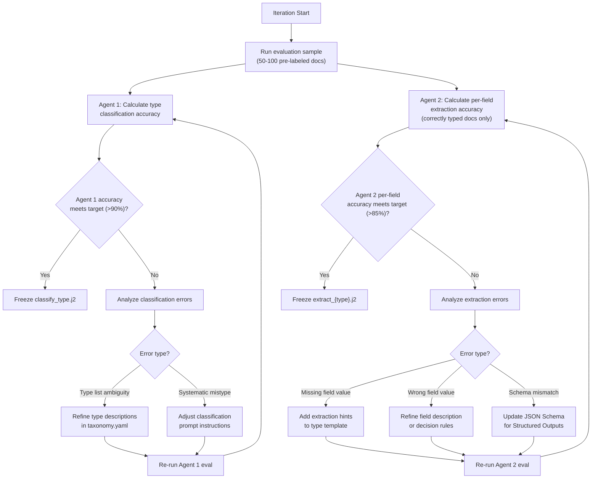

# Prompt Engineering Strategy — Deep Dive

## 1. Prompt Architecture

The pipeline uses a **three-layer prompt strategy** across two specialized agents:

1. **Agent 1 system prompt** — role definition, list of document types with descriptions, classification instructions. Runs on GPT-4o-mini.
2. **Agent 2 system prompt (per-type)** — role definition, common taxonomy (deal type, submarket, counterparty, confidentiality), type-specific field schema, extraction instructions, output format. One template per document type. Runs on GPT-4o with Structured Outputs.
3. **User prompt** — document text + extracted key-value pairs. Shared format used by both agents.

This separation allows:
- A cheap, fast classifier to route documents before expensive extraction
- Type-specific extraction schemas that maximize field accuracy
- Independent tuning of classification vs. extraction prompts
- Taxonomy updates without touching prompt logic
- Clear auditability of what each agent was asked vs. what it received

## 2. System Prompt Design

### Agent 1: Classification Prompt Template

**File:** `prompts/classify_type.j2` · **Model:** GPT-4o-mini · **Output:** JSON mode

Agent 1 is deliberately simple — it determines the document type so Agent 2 can apply the correct extraction schema.

```jinja2
{# prompts/classify_type.j2 #}

You are a document type classifier for a commercial real estate investment firm.
Your task is to classify the document into exactly one of the following types.

## Document Types


- **{{ doc_type.label }}**: {{ doc_type.description }}


## Instructions

1. Read the document text carefully.
2. Classify by document FORMAT, not by the deal type it relates to.
3. A lease proposal in letter format is "Letter of Intent", not "Lease Agreement".
4. If no type clearly applies, use "Other".

## Output Format

Respond with a JSON object:

```json
{
  "documentType": "<one of the types listed above>",
  "confidence": <float 0.0-1.0>,
  "reasoning": "<1-2 sentence explanation>"
}
```
```

### Agent 2: Extraction Prompt Templates

**Files:** `prompts/extract_{type}.j2` (one per document type) · **Model:** GPT-4o · **Output:** Structured Outputs (JSON Schema per type)

Agent 2 receives the classified document type from Agent 1 and extracts both common metadata fields and type-specific fields.

#### Common structure across all extraction templates

```jinja2
{# prompts/extract_{type}.j2 — common skeleton #}

You are a metadata extraction specialist for a commercial real estate investment firm.
This document has been classified as a **{{ document_type }}**.
Extract the following fields from the document content.

## Common Fields

Extract these fields for every document type:

### Deal Type (dealType)
The type of real estate transaction or activity described in the document.
**Allowed values:** Lease, Sale, Development, Acquisition, Disposition, Financing, Other
- If a document discusses both lease and sale terms, classify by the PRIMARY transaction
- Offering memorandums are typically "Sale" unless explicitly a lease proposal

### Submarket (submarket)
The Houston-area submarket where the property is located.
**Allowed values:** Northwest Houston, North Houston, Northeast Houston, Katy/West Houston, Southwest Houston, Southeast Houston, Central Houston, Multiple, Unknown
- Use street addresses, highway references, and neighborhood names to determine submarket

### Counterparty (counterparty)
The external company, broker, or entity involved in the transaction.
- Extract from letterhead, signature blocks, or broker identification
- For brokerage reports, use the brokerage firm name (e.g., "CBRE", "JLL")
- If unidentifiable, use "Unknown"

### Confidentiality (confidentiality)
The confidentiality classification of the document.
**Allowed values:** Public, Internal, Confidential, Highly Confidential
- Look for explicit confidentiality notices, watermarks, or disclaimers
- Executed agreements with financial terms are at minimum "Confidential"
- When in doubt, classify UP (more restrictive)
- Default to "Internal" if no indicators present

## Type-Specific Fields

{{ type_specific_fields_block }}

## Suggested Fields

Additionally, identify any other noteworthy metadata fields present in the document that are not covered by the fields above. Return them in the suggestedFields array as objects with `name`, `value`, and `reasoning`.

## Instructions

1. Base extraction ONLY on the document content provided. Do not infer information not present.
2. For each field, provide a confidence score (0.0 to 1.0) and brief reasoning.
3. If a field cannot be determined, set its value to null with confidence 0.0.
```

#### Type-specific field blocks

Each extraction template includes fields tailored to the document type:

| Document Type | Type-Specific Fields |
|---|---|
| Lease Agreement | tenant, landlord, leaseTerm, rentalRate, squareFootage, commencementDate, expirationDate |
| Offer Memorandum | propertyName, askingPrice, capRate, noi, squareFootage, propertyType |
| Market Report | reportPeriod, marketArea, vacancyRate, absorption, avgRentalRate |
| Purchase Agreement | buyer, seller, purchasePrice, closingDate, earnestMoney |
| Letter of Intent | proposedTermsSummary, responseDeadline, parties |
| Financial Analysis | propertyName, irr, cashOnCash, holdPeriod |
| Due Diligence | propertyAddress, reportType, findingsSummary |
| Correspondence | sender, recipient, subject, date |
| Presentation | audience, topic, date |

Each template defines a strict JSON Schema used with GPT-4o Structured Outputs to guarantee the response conforms to the expected shape.

### User Prompt Template

Shared by both agents — provides the document content.

```jinja2
{# prompts/user_document.j2 #}

Process the following document.

**File name:** {{ file_name }}


**Extracted key-value pairs:**

- {{ kv.key }}: {{ kv.value }} (confidence: {{ kv.confidence }})



**Document text ({{ text_length }} characters, {{ page_count }} pages):**

{{ extracted_text }}
```

## 3. Taxonomy Configuration

The taxonomy is stored as a YAML configuration file, not hardcoded in prompts. The v2.0 format is hierarchical — document types carry their own specific fields, and common categories are defined separately.

```yaml
# docs/taxonomy/taxonomy.yaml

version: "2.0"
last_updated: "2026-07-30"
approved_by: "Client SME Team"

document_types:
  - label: "Lease Agreement"
    description: "Executed or draft lease contract"
    specific_fields:
      - name: tenant
        description: "The tenant / lessee named in the lease"
      - name: landlord
        description: "The landlord / lessor named in the lease"
      - name: leaseTerm
        description: "Duration of the lease (e.g., '5 years', '60 months')"
      - name: rentalRate
        description: "Base rental rate (e.g., '$24.50/SF NNN')"
      - name: squareFootage
        description: "Leased square footage"
      - name: commencementDate
        description: "Lease commencement date"
      - name: expirationDate
        description: "Lease expiration date"

  - label: "Offer Memorandum"
    description: "Property marketing package with financials and property details"
    specific_fields:
      - name: propertyName
        description: "Name of the property being marketed"
      - name: askingPrice
        description: "Listed asking price"
      - name: capRate
        description: "Capitalization rate"
      - name: noi
        description: "Net operating income"
      - name: squareFootage
        description: "Total building square footage"
      - name: propertyType
        description: "Property type (e.g., Industrial, Office, Retail)"

  - label: "Market Report"
    description: "Broker market research, quarterly reports, or market surveys"
    specific_fields:
      - name: reportPeriod
        description: "Time period covered (e.g., 'Q2 2024')"
      - name: marketArea
        description: "Geographic market area covered"
      - name: vacancyRate
        description: "Reported vacancy rate"
      - name: absorption
        description: "Net absorption figure"
      - name: avgRentalRate
        description: "Average rental rate reported"

  - label: "Purchase Agreement"
    description: "Executed or draft purchase/sale contract"
    specific_fields:
      - name: buyer
        description: "Buyer / purchaser entity"
      - name: seller
        description: "Seller entity"
      - name: purchasePrice
        description: "Agreed purchase price"
      - name: closingDate
        description: "Scheduled closing date"
      - name: earnestMoney
        description: "Earnest money deposit amount"

  - label: "Letter of Intent"
    description: "LOI for lease or purchase"
    specific_fields:
      - name: proposedTermsSummary
        description: "Summary of key proposed terms"
      - name: responseDeadline
        description: "Deadline for response or acceptance"
      - name: parties
        description: "Named parties to the LOI"

  - label: "Financial Analysis"
    description: "Pro forma, IRR analysis, cash flow projections"
    specific_fields:
      - name: propertyName
        description: "Property being analyzed"
      - name: irr
        description: "Internal rate of return"
      - name: cashOnCash
        description: "Cash-on-cash return"
      - name: holdPeriod
        description: "Projected hold period"

  - label: "Due Diligence"
    description: "Environmental reports, surveys, title documents, inspections"
    specific_fields:
      - name: propertyAddress
        description: "Address of the subject property"
      - name: reportType
        description: "Type of due diligence report (e.g., Phase I ESA, Survey)"
      - name: findingsSummary
        description: "Summary of key findings"

  - label: "Correspondence"
    description: "Emails, letters, memos"
    specific_fields:
      - name: sender
        description: "Person or entity who sent the correspondence"
      - name: recipient
        description: "Person or entity receiving the correspondence"
      - name: subject
        description: "Subject line or topic"
      - name: date
        description: "Date of the correspondence"

  - label: "Presentation"
    description: "Pitch decks, investment committee presentations"
    specific_fields:
      - name: audience
        description: "Intended audience (e.g., 'Investment Committee')"
      - name: topic
        description: "Presentation topic or title"
      - name: date
        description: "Presentation date"

  - label: "Other"
    description: "Does not fit above categories"
    specific_fields: []

common_categories:
  - name: "Deal Type"
    field_name: "dealType"
    sharepoint_column: "DealType"
    description: "The type of real estate transaction or activity described in the document"
    allowed_values:
      - label: "Lease"
        description: "Lease agreement, lease proposal, or lease-related correspondence"
      - label: "Sale"
        description: "Purchase/sale agreement, offering memorandum, or sales-related document"
      - label: "Development"
        description: "New construction, ground-up development, or build-to-suit project"
      - label: "Acquisition"
        description: "Property acquisition, due diligence, or investment analysis"
      - label: "Disposition"
        description: "Property disposition, marketing package, or exit strategy"
      - label: "Financing"
        description: "Loan documents, financing proposals, or debt-related materials"
      - label: "Other"
        description: "Does not clearly fit any above category"
    decision_rules:
      - "If a document discusses both lease and sale terms, classify by the PRIMARY transaction"
      - "Offering memorandums are typically 'Sale' unless explicitly a lease proposal"
      - "Development pipeline reports are 'Development' even if they mention future leasing"

  - name: "Submarket"
    field_name: "submarket"
    sharepoint_column: "Submarket"
    description: "The Houston-area submarket where the property is located"
    allowed_values:
      - label: "Northwest Houston"
        description: "Highway 290 corridor, Willowbrook, Champions, Cypress"
      - label: "North Houston"
        description: "I-45 North corridor, Greenspoint, IAH Airport area"
      - label: "Northeast Houston"
        description: "I-10 East, Channelview, Baytown"
      - label: "Katy/West Houston"
        description: "I-10 West corridor, Energy Corridor, Katy"
      - label: "Southwest Houston"
        description: "Highway 59 South, Sugar Land, Missouri City"
      - label: "Southeast Houston"
        description: "I-45 South, La Marque, Texas City, Galveston"
      - label: "Central Houston"
        description: "Inner Loop, Midtown, East End"
      - label: "Multiple"
        description: "Document covers multiple submarkets"
      - label: "Unknown"
        description: "Submarket cannot be determined from document content"
    decision_rules:
      - "Use street addresses, highway references, and neighborhood names to determine submarket"
      - "If a document covers a portfolio across submarkets, use 'Multiple'"

  - name: "Counterparty"
    field_name: "counterparty"
    sharepoint_column: "Counterparty"
    description: "The external company, broker, or entity involved in the transaction"
    is_freetext: true
    decision_rules:
      - "Extract the company name from letterhead, signature blocks, or broker identification"
      - "For brokerage reports, use the brokerage firm name (e.g., 'CBRE', 'JLL')"
      - "If no counterparty can be identified, use 'Unknown'"

  - name: "Confidentiality"
    field_name: "confidentiality"
    sharepoint_column: "Confidentiality"
    description: "The confidentiality classification of the document"
    allowed_values:
      - label: "Public"
        description: "No confidentiality restrictions; publicly available information"
      - label: "Internal"
        description: "For internal use only; standard business documents"
      - label: "Confidential"
        description: "Contains confidentiality notices, NDA-covered material, or sensitive financial terms"
      - label: "Highly Confidential"
        description: "Contains trade secrets, executive compensation, litigation material"
    decision_rules:
      - "Look for explicit confidentiality notices, watermarks, or disclaimers"
      - "Executed agreements with financial terms are at minimum 'Confidential'"
      - "If no confidentiality indicators present, default to 'Internal'"
      - "When in doubt, classify UP (more restrictive), never down"

confidence_thresholds:
  agent1_classification: 0.80
  agent2_common:
    dealType: 0.75
    submarket: 0.75
    counterparty: 0.70
    confidentiality: 0.85  # Higher threshold — misclassification has compliance risk
  agent2_specific_default: 0.80
```

## 4. Prompt Tuning Process

### Two-Track Evaluation

The two-agent architecture requires independent evaluation of each agent:

| Track | Metric | Target | Notes |
|---|---|---|---|
| Agent 1 (Classifier) | % documents correctly typed | >90% | Errors cascade — wrong type means Agent 2 uses wrong schema |
| Agent 2 (Extractor) | Per-field extraction accuracy given correct type | >85% per field | Evaluated only on correctly classified documents |

**Cascade risk:** Agent 1 misclassification causes Agent 2 to apply the wrong extraction schema, producing systematically wrong fields. Agent 1 accuracy is therefore the higher-priority target.

### Iteration Workflow (applies to both agents independently)



### Evaluation Framework

```python
# tests/evaluation/evaluate_prompts.py

from dataclasses import dataclass
import json

@dataclass
class ClassificationResult:
    document_id: str
    expected_type: str
    predicted_type: str
    confidence: float
    correct: bool

@dataclass
class ExtractionResult:
    document_id: str
    field: str
    expected: str
    predicted: str
    confidence: float
    correct: bool

def evaluate_agent1(
    evaluation_samples: list[dict],
    classify_fn: callable,
) -> dict:
    """Evaluate Agent 1 document type classification accuracy."""
    results: list[ClassificationResult] = []

    for sample in evaluation_samples:
        classification = classify_fn(
            file_name=sample["file_name"],
            extracted_text=sample["extracted_text"],
            key_value_pairs=sample.get("key_value_pairs", []),
        )
        results.append(ClassificationResult(
            document_id=sample["document_id"],
            expected_type=sample["expected_labels"]["documentType"],
            predicted_type=classification["documentType"],
            confidence=classification["confidence"],
            correct=(classification["documentType"] == sample["expected_labels"]["documentType"]),
        ))

    correct = sum(1 for r in results if r.correct)
    total = len(results)
    errors = [r for r in results if not r.correct]
    error_patterns = {}
    for e in errors:
        key = f"{e.expected_type} → {e.predicted_type}"
        error_patterns[key] = error_patterns.get(key, 0) + 1

    return {
        "accuracy": correct / total if total else 0,
        "correct": correct,
        "total": total,
        "error_patterns": error_patterns,
    }

def evaluate_agent2(
    evaluation_samples: list[dict],
    extract_fn: callable,
) -> dict:
    """Evaluate Agent 2 per-field extraction accuracy on correctly typed documents."""
    results: list[ExtractionResult] = []

    for sample in evaluation_samples:
        doc_type = sample["expected_labels"]["documentType"]
        extraction = extract_fn(
            file_name=sample["file_name"],
            extracted_text=sample["extracted_text"],
            key_value_pairs=sample.get("key_value_pairs", []),
            document_type=doc_type,
        )

        for field, expected_value in sample["expected_labels"].items():
            if field == "documentType":
                continue
            predicted = extraction.get(field, {}).get("value")
            confidence = extraction.get(field, {}).get("confidence", 0.0)
            results.append(ExtractionResult(
                document_id=sample["document_id"],
                field=field,
                expected=expected_value,
                predicted=predicted,
                confidence=confidence,
                correct=(predicted == expected_value),
            ))

    metrics = {}
    fields = set(r.field for r in results)
    for field in fields:
        field_results = [r for r in results if r.field == field]
        correct = sum(1 for r in field_results if r.correct)
        total = len(field_results)
        metrics[field] = {
            "accuracy": correct / total if total else 0,
            "correct": correct,
            "total": total,
        }

    return metrics
```

### Evaluation Sample Format

```json
// tests/evaluation/samples/sample_001.json
{
  "document_id": "sample_001",
  "file_name": "CBRE_Northwest_Houston_Industrial_Q2_2024.pdf",
  "extracted_text": "CBRE RESEARCH | Q2 2024 Houston Industrial Market Report...",
  "key_value_pairs": [
    {"key": "Date", "value": "Q2 2024", "confidence": 0.95}
  ],
  "expected_labels": {
    "documentType": "Market Report",
    "dealType": "Other",
    "submarket": "Northwest Houston",
    "counterparty": "CBRE",
    "confidentiality": "Internal",
    "reportPeriod": "Q2 2024",
    "marketArea": "Northwest Houston",
    "vacancyRate": null,
    "absorption": null,
    "avgRentalRate": null
  },
  "notes": "Quarterly market report — Agent 1 should type as Market Report, Agent 2 should extract common + market report fields"
}
```

## 5. Structured Output Reliability

### Per-Agent Output Strategy

| Agent | Model | Output Mode | Rationale |
|---|---|---|---|
| Agent 1 (Classifier) | GPT-4o-mini | `response_format: json_object` | Schema is trivial (3 fields) — JSON mode is sufficient and simpler |
| Agent 2 (Extractor) | GPT-4o | Structured Outputs (`response_format` with JSON Schema) | Complex, type-varying schemas — guaranteed schema compliance prevents parse failures |

Agent 2's JSON Schema is generated per document type from the taxonomy configuration, ensuring the model can only return fields defined for that type.

### Handling Parse Failures

```python
# shared/response_parser.py

import json
from pydantic import BaseModel, ValidationError
from models.pipeline import ClassificationResponse, ExtractionResponse

def parse_classification_response(raw_response: str) -> ClassificationResponse:
    """Parse Agent 1 classification response (JSON mode)."""
    try:
        data = json.loads(raw_response)
    except json.JSONDecodeError as e:
        raise ClassificationParseError(
            f"Response is not valid JSON: {e}",
            raw_response=raw_response,
            retry_with_fallback=True,
        )
    try:
        return ClassificationResponse.model_validate(data)
    except ValidationError as e:
        raise ClassificationParseError(
            f"Response does not match expected schema: {e}",
            raw_response=raw_response,
            retry_with_fallback=True,
        )

def parse_extraction_response(raw_response: str, document_type: str) -> ExtractionResponse:
    """Parse Agent 2 extraction response (Structured Outputs — parse failures should be rare)."""
    try:
        data = json.loads(raw_response)
    except json.JSONDecodeError as e:
        raise ExtractionParseError(
            f"Response is not valid JSON: {e}",
            raw_response=raw_response,
            document_type=document_type,
        )
    try:
        return ExtractionResponse.model_validate(data)
    except ValidationError as e:
        raise ExtractionParseError(
            f"Response does not match {document_type} schema: {e}",
            raw_response=raw_response,
            document_type=document_type,
        )

class ClassificationParseError(Exception):
    def __init__(self, message: str, raw_response: str, retry_with_fallback: bool = False):
        super().__init__(message)
        self.raw_response = raw_response
        self.retry_with_fallback = retry_with_fallback

class ExtractionParseError(Exception):
    def __init__(self, message: str, raw_response: str, document_type: str):
        super().__init__(message)
        self.raw_response = raw_response
        self.document_type = document_type
```

## 6. Token Budget Management

### Document Text Truncation Strategy

GPT-4o supports 128K context, but cost and latency increase with token count. Strategy:

| Document Size | Strategy | Max Tokens (Input) |
|--------------|----------|-------------------|
| < 4K tokens (~3 pages) | Send full text | 4,000 |
| 4K–8K tokens (~6 pages) | Send full text | 8,000 |
| 8K–16K tokens (~12 pages) | Send first + last 2 pages | 8,000 |
| > 16K tokens (>12 pages) | Send first 3 pages + last page + key-value pairs | 6,000 |

```python
# shared/text_utils.py

def truncate_for_classification(text: str, max_tokens: int = 8000) -> str:
    """Truncate document text to fit within token budget while preserving signal."""
    
    # Rough estimate: 1 token ≈ 4 characters for English text
    max_chars = max_tokens * 4
    
    if len(text) <= max_chars:
        return text
    
    # Split by page breaks (inserted during extraction)
    pages = text.split("--- PAGE BREAK ---")
    
    if len(pages) <= 3:
        # Short doc — just hard truncate
        return text[:max_chars] + "\n\n[TRUNCATED — document continues]"
    
    # Strategy: first 3 pages + last page
    first_pages = "--- PAGE BREAK ---".join(pages[:3])
    last_page = pages[-1]
    
    truncated = (
        first_pages
        + "\n\n[... MIDDLE PAGES OMITTED ...]\n\n"
        + last_page
    )
    
    if len(truncated) > max_chars:
        return truncated[:max_chars] + "\n\n[TRUNCATED]"
    
    return truncated
```

## 7. Cost Optimization Path

The two-agent architecture already separates cost concerns by model:

| Agent | Model | Cost per doc | Purpose |
|---|---|---|---|
| Agent 1 | GPT-4o-mini | ~$0.001 | Classification (cheap, fast) |
| Agent 2 | GPT-4o | ~$0.01–0.03 | Extraction (accurate, schema-enforced) |

### Phase 1: Accuracy First

- Agent 1 on GPT-4o-mini from the start (classification is simple enough)
- Agent 2 on GPT-4o for all extraction during prompt tuning
- Full text where possible (better accuracy)
- Combined cost: ~$0.01–0.03/doc

### Phase 2: Extraction Cost Optimization

After extraction prompts are stable and per-field accuracy validated:

1. Run Agent 2 evaluation suite against GPT-4o-mini
2. If per-field accuracy delta < 2% → switch Agent 2 to GPT-4o-mini (~$0.002/doc total)
3. If accuracy delta > 2% for specific document types → hybrid: GPT-4o-mini for simple types (Correspondence, Presentation), GPT-4o for complex types (Lease, Financial Analysis)

### Phase 3: Caching (Future)

- Cache both classification and extraction results keyed by document content hash
- On re-processing, skip Agent 1 if hash matches; skip Agent 2 if hash + type match
- Invalidate cache when taxonomy or prompts change
