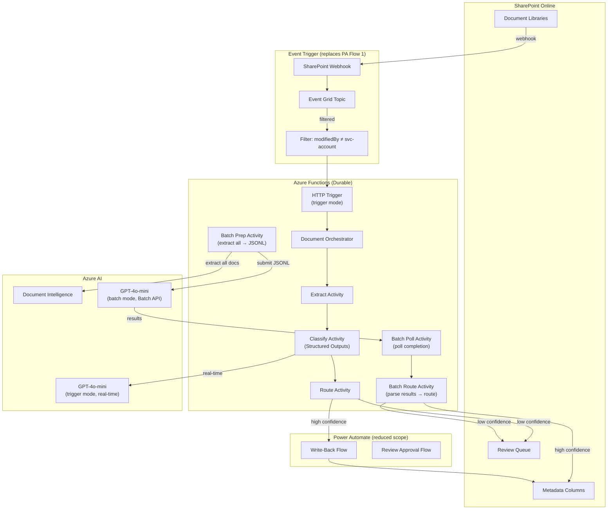

# Alternative Approaches Analysis: IDV Document Enrichment Pipeline

**Date:** 2026-07-30  
**Analyst:** Systems Thinking Facilitator  
**Status:** Recommendation — pending team decision

---

## System Context

The current architecture processes ~25K CRE documents (batch) then handles event-driven trickle (~50–100/week). Key system dynamics identified in the [system dynamics analysis](system-dynamics-analysis.md):

- **R1 (Re-Trigger Amplification):** Write-back fires new SharePoint events → potential infinite loops
- **R2 (Review Queue Death Spiral):** 3,750 review items at 15/day drain = 250 business days
- **B1 (Threshold Oscillation):** Queue pressure → threshold lowering → misclassification → pressure reversal
- **B2 (Prompt Tuning Loop):** 4–8 week delay per iteration, only 3 iterations planned
- **R3 (Cost Escalation):** Re-triggers + retries amplify API spend

Each alternative is evaluated against these dynamics — does it dampen a harmful loop, accelerate a beneficial one, or introduce new dynamics?

---

## Alternative Analysis

### 1. Azure OpenAI Batch API (replace Durable Functions fan-out for batch mode)

**What it does:** Submit a JSONL file of all classification requests, receive results asynchronously (typically 1–24 hours). 50% cost discount vs. real-time API.

#### System Dynamics Impact

| Dynamic | Effect |
|---------|--------|
| R3 (Cost) | **Directly dampens.** 50% cost reduction on classification (the dominant cost line) |
| R2 (Review Queue) | Neutral — same volume, just cheaper |
| Orchestration complexity | **Eliminates** fan-out/fan-in for batch — no queue management, no concurrency tuning, no rate-limit backpressure |
| Delay | Introduces 1–24h latency on batch results (acceptable — batch is not real-time) |

#### Assessment

| Dimension | Rating |
|-----------|--------|
| Effort to implement | **Low.** Generate JSONL from extraction results, submit via Batch API, poll for completion, parse results. ~2–3 days development. Durable Functions batch orchestrator becomes a simple two-step: (1) extract all → build JSONL, (2) submit batch → poll → route results |
| Cost impact (25K docs) | **Significant.** Classification is ~$0.02/doc at GPT-4o pricing. 25K × $0.02 = $500 baseline. Batch API = $250. Saves ~$250 on initial batch alone. Ongoing savings on any re-processing |
| Risk reduction | **High.** Eliminates rate-limiting complexity, removes concurrency bugs, simplifies retry logic |
| Risk introduction | **Low.** No per-document progress/retry — but extraction still uses Durable (retry-safe). A failed batch can be re-submitted. Partial failure handling needs design |
| Complement vs. replace | **Complement.** Use Batch API for batch mode only. Keep Durable Functions for trigger-mode (single-doc, real-time). Two-mode architecture already exists |

#### Verdict: **ADOPT for batch mode**

---

### 2. SharePoint Premium (Syntex) Content Classification

**What it does:** Microsoft's native AI classification service built into SharePoint. Trains custom models on document examples, applies labels automatically.

#### System Dynamics Impact

| Dynamic | Effect |
|---------|--------|
| R1 (Re-Trigger) | **Eliminates** — native SharePoint classification doesn't trigger file-modified events |
| R2 (Review Queue) | Unknown — depends on Syntex confidence handling (less configurable) |
| B2 (Prompt Tuning) | **Replaced** by model retraining (different skill, different cycle time) |
| Flexibility | **Constrains** — may not support 5-category taxonomy with per-category confidence thresholds |

#### Assessment

| Dimension | Rating |
|-----------|--------|
| Effort to implement | **High.** Requires labeled training set (500+ docs per category), model training, validation. Different paradigm — no prompt engineering transferable. Must verify Syntex supports CRE taxonomy granularity (e.g., 20+ submartket values) |
| Cost impact | **Unclear/Negative.** SharePoint Premium charges per-document ($3–5/user/month or pay-per-use). At scale, likely MORE expensive than GPT-4o API calls. No batch discount |
| Risk reduction | Eliminates R1 (re-trigger) entirely. Removes Azure dependency for classification |
| Risk introduction | **High.** Vendor lock-in to Microsoft content services pricing model. Less control over classification logic. Taxonomy changes require retraining (days, not minutes). May not achieve required granularity for Submarket/Counterparty classification |
| Complement vs. replace | **Replace** — fundamentally different approach to classification |

#### Verdict: **SKIP.** Cost model is unfavorable at scale, insufficient taxonomy flexibility, and the pipeline already handles classification well. The only advantage (eliminating R1) is better solved by fixing the dedup logic.

---

### 3. Event Grid + SharePoint Webhooks (replace Power Automate trigger)

**What it does:** SharePoint webhooks push change notifications to Event Grid, which routes directly to Azure Functions. Eliminates Power Automate as the trigger mechanism.

#### System Dynamics Impact

| Dynamic | Effect |
|---------|--------|
| R1 (Re-Trigger) | **Partially mitigates.** Event Grid supports deduplication and filtering at the platform level. Can filter on `modifiedBy` to ignore service-account modifications (the write-back identity) |
| R3 (Cost) | **Dampens.** Eliminates Power Automate Premium licensing ($15–40/user/month) and per-run action costs. Event Grid is effectively free at this volume (<$0.60/million events) |
| Operational risk | Introduces webhook subscription renewal (every 30 days, must be automated) |

#### Assessment

| Dimension | Rating |
|-----------|--------|
| Effort to implement | **Medium.** Requires: (1) Register SharePoint webhook → Event Grid topic, (2) Azure Function subscription, (3) Automated renewal function (timer-triggered, renews every 25 days), (4) Event Grid filtering rules. ~1 week development |
| Cost impact | **Significant.** Power Automate Premium: ~$15/user/month × affected users, or $500/month for per-flow licensing. Event Grid + Functions: <$5/month for this volume. **~$500/month savings** |
| Risk reduction | **Moderate.** Removes Power Automate as single point of failure (reliability issues, connector throttling, occasional platform outages). Enables programmatic testing (webhook is just HTTP). R1 mitigation via `modifiedBy` filtering is MORE reliable than instance-ID dedup |
| Risk introduction | **Moderate.** Webhook renewal is a operational burden (if renewal fails, events stop arriving silently). No visual flow designer (harder for non-developers to understand). Less organizational familiarity |
| Complement vs. replace | **Replace** Power Automate for trigger flow ONLY. Write-back flow (Flow 2) and Review Approval flow (Flow 3) still benefit from Power Automate's SharePoint connector |

#### Verdict: **ADOPT (Phase 2).** The R1 mitigation alone justifies this. Filtering by `modifiedBy != service-account` at the Event Grid level is a structural fix for the re-trigger amplification loop. Implement after trigger-mode goes live and the re-trigger risk is validated.

---

### 4. Azure Logic Apps Standard (replace Power Automate)

**What it does:** Same connector ecosystem as Power Automate, but runs on dedicated App Service infrastructure. Git-deployable, higher action limits (millions/month), better error handling.

#### System Dynamics Impact

| Dynamic | Effect |
|---------|--------|
| R1 (Re-Trigger) | **No improvement.** Same SharePoint trigger semantics — still fires on modification |
| R3 (Cost) | **Neutral to slight improvement.** Logic Apps Standard base cost (~$180/month for WS1) vs. Power Automate Premium per-user licensing. Break-even depends on user count |
| Operational | **Improves.** Git-deployable = testable, version-controlled. Run history is more detailed. Retry policies are more configurable |

#### Assessment

| Dimension | Rating |
|-----------|--------|
| Effort to implement | **Medium.** Near 1:1 migration from Power Automate flows (same connectors, similar designer). Main work: re-author 3 flows, configure App Service, set up CI/CD |
| Cost impact | **Marginal.** ~$180/month base + connector costs vs. Power Automate Premium licensing. Depends on org licensing model (may already be covered) |
| Risk reduction | **Low-Moderate.** Better observability, testability, deployment control. But doesn't solve the structural problems (R1, R2) |
| Risk introduction | **Low.** Mature service, well-understood |
| Complement vs. replace | **Replace** all three Power Automate flows |

#### Verdict: **DEFER.** Only worth pursuing if Power Automate proves unreliable in production or if the org hits action-limit throttling. If Alternative #3 (Event Grid) is adopted for the trigger flow, Logic Apps' value proposition shrinks to write-back + approval flows only — not worth the migration effort for two small flows.

---

### 5. GPT-4o Structured Outputs (JSON Schema enforcement)

**What it does:** Instead of JSON mode (which asks the model to output JSON but doesn't guarantee schema compliance), Structured Outputs enforce a specific JSON Schema. The model MUST produce output matching the schema — invalid responses are impossible.

#### System Dynamics Impact

| Dynamic | Effect |
|---------|--------|
| Error-retry loop | **Eliminates** parse-failure retries. Currently, if the model returns malformed JSON or unexpected field values, the classify activity retries (up to 3 attempts). Structured Outputs makes this impossible |
| R3 (Cost) | **Slight dampens.** Eliminates wasted tokens on failed-parse retries |
| Confidence routing | Schema can enforce confidence values as `number` in [0, 1] range — prevents string-type confidence bugs |

#### Assessment

| Dimension | Rating |
|-----------|--------|
| Effort to implement | **Very low.** Change `response_format` from `{"type": "json_object"}` to `{"type": "json_schema", "json_schema": {...}}` in the classify activity. Define schema matching `ClassificationResult`. ~2 hours work |
| Cost impact | **Negligible direct savings** (slightly higher latency per request, but eliminates retry cost). Net neutral to slightly positive |
| Risk reduction | **High.** Eliminates an entire class of runtime failures. The response parser becomes a simple `json.loads()` + Pydantic validation with zero possibility of schema mismatch |
| Risk introduction | **Very low.** Schema changes require redeployment (but taxonomy changes already require redeployment of prompt templates). Minor latency increase (~100–200ms) |
| Complement vs. replace | **Complement.** Drop-in improvement to the existing classify activity. Eliminates `response_parser.py` complexity |

#### Verdict: **ADOPT immediately.** Trivial effort, eliminates a failure mode, no downside. Should be the first change implemented.

---

### 6. GPT-4o-mini for Classification (after prompt stabilization)

**What it does:** GPT-4o-mini is 10–20x cheaper than GPT-4o with comparable performance on focused, well-defined tasks like document classification with explicit taxonomy injection.

#### System Dynamics Impact

| Dynamic | Effect |
|---------|--------|
| R3 (Cost) | **Dramatically dampens.** At $0.15/1M input tokens vs. $2.50/1M (GPT-4o), classification cost drops from ~$0.02/doc to ~$0.001–0.002/doc. 25K docs: $500 → $25–50 |
| B2 (Prompt Tuning) | **Slight risk.** Mini may require tighter prompts — tuning iterations become more critical. But taxonomy injection constrains the task sufficiently |
| R2 (Review Queue) | **Slight risk.** If mini's classification accuracy is 2–5% lower, review queue grows. Must validate empirically |

#### Assessment

| Dimension | Rating |
|-----------|--------|
| Effort to implement | **Very low.** Change the model deployment name in config. No code changes. Run validation batch against labeled test set first |
| Cost impact | **Transformative.** 10–20x reduction in the dominant variable cost. At 25K docs, saves $450–475 on initial batch. Ongoing trigger-mode savings of 90%+ on classification API |
| Risk reduction | **Neutral.** Does not fix structural issues. But massively reduces cost pressure from R3, removing the incentive to cut corners elsewhere |
| Risk introduction | **Moderate.** Classification quality may degrade for edge cases (ambiguous documents, multi-category, unusual formats). Must validate with A/B test on 500+ docs before switching |
| Complement vs. replace | **Replace** GPT-4o deployment for classification (keep GPT-4o available for fallback on low-confidence edge cases) |

#### Verdict: **ADOPT after prompt iteration 2.** Run a validation batch comparing GPT-4o vs. GPT-4o-mini on the same 500 documents after prompt iteration 2 stabilizes the prompt. If accuracy delta is <3% on overall routing decisions, switch. Keep GPT-4o as fallback for manual re-classification requests.

---

### 7. Semantic Kernel / Prompty for Prompt Management (replace Jinja2)

**What it does:** Azure-native prompt orchestration framework. Provides: structured prompt templates with metadata, built-in token counting, automatic truncation, retry policies, structured output parsing, telemetry.

#### System Dynamics Impact

| Dynamic | Effect |
|---------|--------|
| B2 (Prompt Tuning) | **Slight acceleration.** Better prompt versioning and A/B testing support could shorten iteration cycle. But the bottleneck is corrections accumulation + human analysis, not tooling |
| Operational | Adds dependency management overhead. Team must learn new framework |

#### Assessment

| Dimension | Rating |
|-----------|--------|
| Effort to implement | **Medium.** Replace Jinja2 template loading with Semantic Kernel / Prompty YAML format. Refactor classify activity to use SK's chat completion abstraction. ~3–5 days |
| Cost impact | **None.** Same API calls underneath |
| Risk reduction | **Low.** Jinja2 templates work fine for this use case (single-turn classification, no chaining, no memory). SK adds value for multi-step agent workflows — this is a single API call |
| Risk introduction | **Low-Moderate.** New dependency, version churn (SK evolving rapidly), team learning curve |
| Complement vs. replace | **Replace** Jinja2 template loading + response parsing |

#### Verdict: **SKIP.** Over-engineering for this use case. The pipeline makes one API call per document with a well-defined prompt template. Jinja2 + Pydantic handles this adequately. Semantic Kernel's value proposition is multi-step orchestration, tool calling, and agent memory — none of which apply here. Revisit only if the pipeline evolves to include multi-model chains.

---

### 8. Microsoft 365 Copilot Agents / Declarative Agents

**What it does:** Custom Copilot agents that operate within the M365 context. Could theoretically classify documents as users interact with them in SharePoint.

#### System Dynamics Impact

| Dynamic | Effect |
|---------|--------|
| R1 (Re-Trigger) | **Eliminates** — no background automation, classification happens in-context |
| R2 (Review Queue) | **Eliminates** — human is already in the loop at classification time |
| Throughput | **Collapses.** Cannot process 25K documents without human interaction |

#### Assessment

| Dimension | Rating |
|-----------|--------|
| Effort to implement | **High.** New paradigm — declarative agent authoring, plugin development, testing in M365 context. Technology is very new (GA late 2025) |
| Cost impact | **Negative.** Copilot licensing ($30/user/month) for all users who need classification. At scale, FAR more expensive than API calls |
| Risk reduction | **None for batch.** Cannot address the 25K backlog problem |
| Risk introduction | **Very high.** Immature technology, rapidly changing API surface, limited customization (cannot enforce per-category thresholds, cannot guarantee structured output) |
| Complement vs. replace | Neither — different paradigm entirely (human-in-the-loop at trigger time vs. automated batch) |

#### Verdict: **SKIP.** Fundamentally incompatible with the requirement to process 25K documents automatically. The per-user licensing model doesn't fit a background processing pipeline. Interesting for future "classify as you save" UX enhancement, but cannot replace the batch pipeline.

---

### 9. Azure AI Studio Custom Document Classifier

**What it does:** Train a supervised classification model on labeled CRE documents. The model learns classification patterns from examples rather than instructions.

#### System Dynamics Impact

| Dynamic | Effect |
|---------|--------|
| B2 (Prompt Tuning) | **Replaced** by model retraining. Different feedback loop: corrections → labeled data → retrain → deploy. Longer cycle (days vs. hours) but potentially higher ceiling |
| R2 (Review Queue) | **Potentially reduces** if trained model achieves higher accuracy than prompt-engineered LLM. But requires validation |
| Explainability | **Reduces.** LLM provides per-category reasoning text; custom classifier outputs confidence only |

#### Assessment

| Dimension | Rating |
|-----------|--------|
| Effort to implement | **Very high.** Requires: (1) Label 500+ documents per category (2,500+ total labeling decisions), (2) Train custom model, (3) Validate against hold-out set, (4) Integrate model endpoint, (5) Handle taxonomy changes (relabel + retrain). Estimated 4–8 weeks of labeling effort alone |
| Cost impact | **Positive long-term** — inference is cheaper than GPT-4o. But training cost + labeling labor cost offsets savings for a long time |
| Risk reduction | **Low.** Doesn't address structural pipeline issues (R1, R3). Classification accuracy is unproven until trained |
| Risk introduction | **High.** Taxonomy changes require relabeling + retraining (days/weeks delay). No reasoning text → harder to debug misclassifications. Cold-start problem — need 25K docs processed to generate training data, which is the problem we're solving |
| Complement vs. replace | **Replace** GPT-4o classification entirely |

#### Verdict: **SKIP (revisit in 6 months).** Classic chicken-and-egg: need labeled data to train, but need the pipeline to generate labeled data. Run the GPT-4o pipeline first, accumulate corrections as labeled data, then evaluate whether a custom model outperforms the tuned prompt. This becomes viable AFTER prompt iteration 3 + review queue completion.

---

## Ranked Recommendations

### Tier 1: Adopt Now (high value, low effort)

| Priority | Alternative | Action | Impact |
|----------|------------|--------|--------|
| 1 | **#5 Structured Outputs** | Switch `response_format` to `json_schema` | Eliminates parse failures, ~2 hours effort |
| 2 | **#1 Batch API** | Use OpenAI Batch API for initial 25K batch | 50% cost reduction on batch, removes orchestration complexity |

### Tier 2: Adopt After Validation (high value, requires evidence)

| Priority | Alternative | Action | Impact |
|----------|------------|--------|--------|
| 3 | **#6 GPT-4o-mini** | A/B test after prompt iteration 2 | 10–20x cost reduction if accuracy holds |
| 4 | **#3 Event Grid + Webhooks** | Implement when trigger-mode goes live | Structural fix for R1 (re-trigger), eliminates PA Premium cost |

### Tier 3: Defer (conditional value)

| Priority | Alternative | Condition to Reconsider |
|----------|------------|------------------------|
| 5 | **#4 Logic Apps Standard** | Only if Power Automate proves unreliable at scale |
| 6 | **#9 Custom Classifier** | After 6 months of labeled data accumulation |

### Tier 4: Skip (unfavorable trade-offs)

| Alternative | Reason |
|-------------|--------|
| **#2 SharePoint Premium** | Per-doc cost unfavorable, insufficient taxonomy flexibility |
| **#7 Semantic Kernel** | Over-engineering for single-call classification |
| **#8 M365 Copilot Agents** | Cannot address batch processing, immature, expensive licensing |

---

## Combined Architecture (Tiers 1 + 2 Adopted)

### Key Changes from Current Architecture

1. **Batch mode:** Extract → JSONL → Batch API → route. No fan-out orchestration
2. **Trigger mode:** Event Grid replaces Power Automate Flow 1. `modifiedBy` filter kills R1
3. **Model:** GPT-4o-mini for both modes (after validation)
4. **Output format:** Structured Outputs — no parse failures possible
5. **Power Automate scope reduced** to write-back + approval only (2 simple flows)

### Cost Impact Summary (25K batch + 1 year trigger mode)

| Component | Current | After Tier 1+2 | Savings |
|-----------|---------|----------------|---------|
| Classification (batch, 25K) | ~$500 (GPT-4o) | ~$12.50 (mini + Batch API) | $487 |
| Classification (trigger, 5K/year) | ~$100/year | ~$5/year | $95/year |
| Power Automate Premium | ~$500/month | ~$0 (Event Grid <$1/month) | ~$6,000/year |
| Parse-failure retries | ~5% overhead | $0 | Eliminated |
| Re-trigger doubling | ~100% overhead (trigger mode) | $0 | Eliminated |
| **Total first-year savings** | | | **~$7,000+** |

---

## Systemic Risk Assessment

### Risks Resolved by Tier 1+2

| Risk | Mitigation |
|------|-----------|
| R1 (Re-Trigger Amplification) | Event Grid `modifiedBy` filter — structural elimination |
| R3 (Cost Escalation) | Batch API + GPT-4o-mini = 95%+ cost reduction |
| Parse failures → retry storms | Structured Outputs — impossible by construction |
| Fan-out complexity bugs | Batch API — no fan-out needed for batch mode |

### Risks NOT Resolved (require other interventions)

| Risk | Required Intervention |
|------|----------------------|
| R2 (Review Queue Death Spiral) | Lower the 15% review rate via prompt tuning; batch the initial 25K to avoid 3,750-item queue |
| B1 (Threshold Oscillation) | Establish threshold governance process with measurement periods |
| B2 (Prompt Tuning delay) | Not addressable by architecture swap — requires process acceleration |

---

## Next Steps

1. **Immediate:** Switch to Structured Outputs (Alternative #5) — no blockers, pure improvement
2. **Before batch run:** Implement Batch API integration (Alternative #1) — reduces batch cost by 50% even before mini validation
3. **During pilot:** Run GPT-4o vs. GPT-4o-mini A/B test on 500 pilot documents (Alternative #6)
4. **Before trigger-mode GA:** Implement Event Grid + Webhook trigger (Alternative #3) — structural fix for R1
