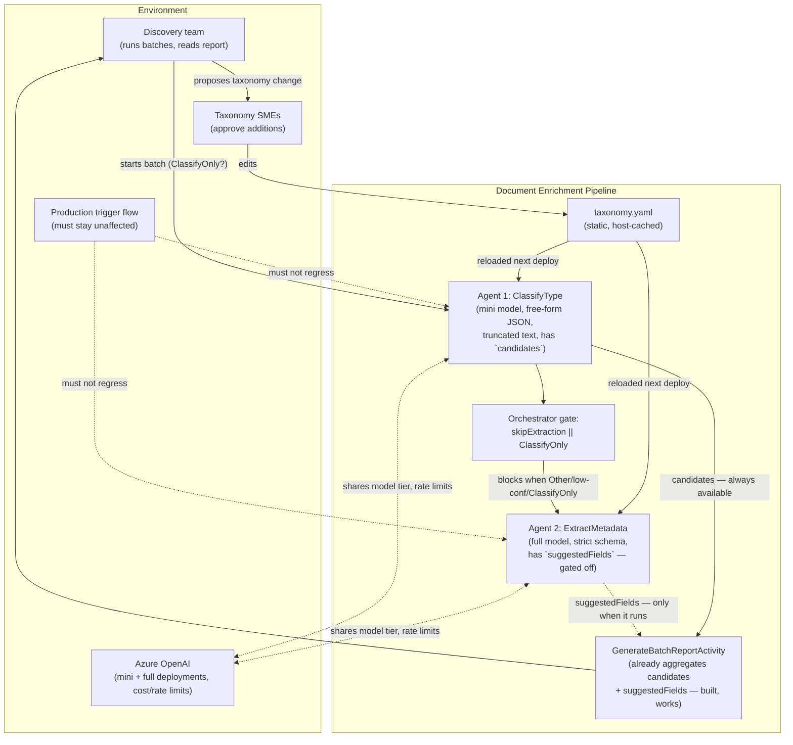
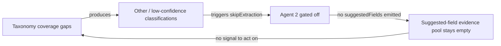
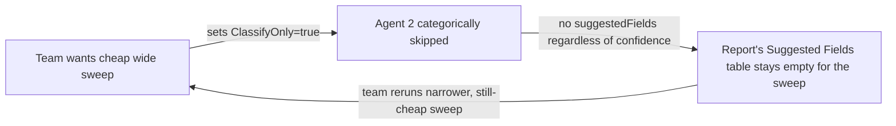
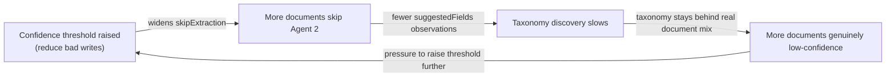
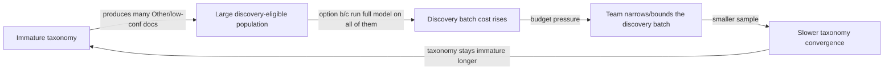

# System Map: Temporary Field-Discovery Capability Placement

**Date:** 2026-09-14
**Analyst:** Systems Thinking Facilitator
**Status:** Hypotheses for validation — leverage points and risk calls are not certainties; the architecture agent should review implementation, and the product-coach should confirm effort/value before commit.

---

## 0. Framing

The question is not "can we detect new fields" — Agent 2 already can, via the existing
`suggestedFields` mechanism (`ExtractMetadata.hbs`, `MetadataSchemaBuilder.BuildSchema`).
The question is a **structural placement problem**: where does a *temporary* discovery
capability sit so it (a) reaches the documents that most need discovery — ambiguous/Other,
low-confidence, and classify-only sweeps — and (b) can be deleted cleanly without leaving
scar tissue in the production classify/extract contracts.

A second, more important finding changes the shape of the answer: **the aggregation and
reporting layer for field discovery already exists and already runs on every batch**,
independent of which option is chosen. `GenerateBatchReportActivity` already builds a
`SuggestedFieldsByGroup` / `SuggestedFieldsByDocumentType` section, keyed off
`BatchDocumentEntry.SuggestedFieldKeys` (populated from `result.Metadata?.SuggestedFields`),
and renders it as an HTML table ("Fields the AI discovered that are not in the current
taxonomy. High-frequency fields are candidates for taxonomy additions.") — this is live,
committed, production code, not a proposal. The batch report also already has a working
**type-level** discovery section, "Low-Confidence Classifications," fed by Agent 1's
`candidates` array via `ChunkOrchestrator.BuildLowConfidenceEntry` — and that section works
correctly today in every mode, including `ClassifyOnly`, because `ClassifyType` always runs.

So the real gap is narrower than "build field discovery." It is: **the field-level half of
an already-built reporting pipeline has no data, for exactly the documents where taxonomy
discovery matters most**, because `ExtractMetadata` (the only producer of `SuggestedFields`)
is gated off by `skipExtraction` and `ClassifyOnly` before it ever runs.

---

## 1. System Boundary

### Inside the system under study

| Component | Role |
|---|---|
| `ClassifyTypeActivity` / `ClassifyType.hbs` (Agent 1) | Cheap-model, free-form-JSON classification; already emits type-level `candidates` when uncertain |
| `ExtractMetadataActivity` / `ExtractMetadata.hbs` (Agent 2) | Expensive-model, strict-schema extraction; already emits field-level `suggestedFields` — but only when it runs |
| `DocumentOrchestrator` gating (`skipExtraction`, `message.ClassifyOnly`) | Decides whether Agent 2 runs at all — the chokepoint this analysis is about |
| `MetadataSchemaBuilder` | Builds Agent 2's strict per-`DocumentType` JSON schema from the taxonomy |
| `TaxonomyLoader` / `docs/taxonomy/taxonomy.yaml` | Static, host-lifetime-cached taxonomy — the thing discovery output is meant to improve |
| `BatchOrchestrator` / `ChunkOrchestrator` / `GenerateBatchReportActivity` | The batch sweep + reporting pipeline that already aggregates and surfaces `suggestedFields` and `candidates` |
| `RouteResultActivity` telemetry (`DocumentEnriched` event) | Per-field confidence metrics — currently blind to `suggestedFields` |
| `WriteMetadataActivity` | Writes `SuggestedFields` back to SharePoint as a JSON column per-document (production write path, not batch-report-only) |

### Outside the system (environment)

| Actor / System | Interaction |
|---|---|
| The team running discovery batches (this request's requester) | Consumes the batch HTML/JSON report; decides taxonomy changes |
| Taxonomy SMEs / governance | Approve additions to `taxonomy.yaml` (per its own header: "Flagged for SME review — do not silently drop; confirm before adding back") |
| Azure OpenAI platform (mini + full deployments) | Cost and rate-limit constraint on both agents |
| SharePoint document libraries | Source corpus for discovery batches |
| Production document flow (real-time trigger ingestion) | Must not be slowed, cost-inflated, or quality-degraded by whatever discovery mechanism is chosen |
| Future taxonomy versions (v5, v6...) | Downstream consumer of discovery findings — the taxonomy is versioned (`taxonomy.yaml` header: `version: "4.0"`) |

### Boundary diagram

---

## 2. Stock-and-Flow Map

| Stock | Inflow | Outflow | Unit |
|---|---|---|---|
| **Taxonomy completeness** (fields/types actually covered) | SME-approved additions from discovery findings | Taxonomy drift as new document forms appear in the corpus | Fields/types |
| **Unclassified/low-signal document backlog** (Other, low-confidence, ClassifyOnly-swept) | New/ambiguous document forms arriving; ClassifyOnly sweeps that intentionally accumulate cheap signal | Taxonomy updates that reclassify them into a named type/field next run | Documents |
| **Suggested-field evidence pool** (accumulated `suggestedFields` observations, currently mostly empty for the cases that matter) | Every Agent 2 run that fires — currently only non-Other, above-threshold, non-ClassifyOnly documents | Consumption into a taxonomy-change proposal; irrelevant/noise suggestions discarded by SME review | Field observations |
| **Discovery/production LLM cost** | Every additional Agent-2-tier (or Agent-1-tier) call added for discovery purposes | Budget cycle reset; scope-limited/bounded discovery batches | USD / tokens |
| **Temporary-tooling debt** (code paths, flags, schemas built "for discovery only") | Every discovery-specific branch, flag, or schema added to production files | Deliberate removal once taxonomy work concludes | Lines of code / conditional branches |
| **Review queue depth** (documents routed to `RoutingDecision.Review`) | Low-confidence field/type classifications | SME correction, or a widened taxonomy that resolves ambiguity | Documents |

Key observation: the **suggested-field evidence pool is starved by construction**. Its
only producer (`ExtractMetadata`) is switched off precisely when a document is a discovery
candidate (Other, low-confidence, or part of a cheap `ClassifyOnly` sweep) — so the stock
that should be filling fastest for the highest-value cases is the one guaranteed to stay
at zero for them today.

---

## 3. Feedback Loop Inventory

### Loop 1 — "Discovery Starvation" (R, currently dominant, mostly hidden)

Low taxonomy coverage → more documents classified `Other`/low-confidence → those are exactly
the documents gated away from Agent 2 → no `suggestedFields` evidence generated for them →
taxonomy stays incomplete → loop repeats.

- **Type:** Reinforcing (a vicious cycle, not growth — it reinforces *stagnation*).
- **Dominance:** Currently dominant. This is *why* the requester is asking the question at all — the existing mechanism cannot self-correct because it never fires where it's needed.
- **Delay:** Long and invisible. Nothing alerts anyone that the evidence pool is empty; it just silently is. The gap is only visible if someone reads the code (as this analysis did) or notices the batch report's "Suggested Fields" section is empty specifically for the `Other` rows.
- **Visibility:** Low. `RouteResultActivity` telemetry tracks per-field confidence for schema-known fields but does not track "documents that never got an extraction pass" as a distinct discoverable metric.

### Loop 2 — "Cheap Sweep Blindness" (B, currently dominant by design)

Batch/discovery runs default to `ClassifyOnly=true` (or a low `MaxPages`) because that is the
cheap way to sweep a large corpus → `ClassifyOnly` unconditionally blocks Agent 2 → the
cheapest, most-repeatable discovery mechanism (a wide sweep) is also the one guaranteed to
produce zero field-level discovery signal, regardless of confidence.

- **Type:** Balancing — it's a deliberate cost control, working exactly as designed. The "unintended consequence" is that the same control also suppresses the thing the team now wants from those same runs.
- **Dominance:** Dominant for any run that uses the batch trigger's default discovery posture (sweep broadly, cheaply).
- **Delay:** Immediate technically (the gate is a single boolean check) but the *organizational* delay — someone runs a sweep, waits for the report, opens it, and only then discovers the suggested-fields section is empty — can be a full batch cycle (hours, for large corpora).

### Loop 3 — "Threshold/Confidence Interaction" (B, secondary)

Per-type confidence thresholds (`GetTypeConfidenceThreshold`, taxonomy `Agent2Content`
thresholds) determine `skipExtraction`. Tightening thresholds to reduce false-positive
writes also widens the set of documents that never reach Agent 2 — shrinking the discovery
evidence pool at the same time it's trying to protect data quality.

- **Type:** Balancing on data quality, but it has a reinforcing side-effect on taxonomy staleness — a classic "fixes that fail" shape (see Section 7).
- **Delay:** Threshold changes are usually deliberate and infrequent (config/deploy cycle), but their effect on the discovery pool compounds silently between taxonomy review cycles.

### Loop 4 — "Cost Tier Escalation" (B, the constraint any option must respect)

Any option that runs Agent-2-tier (full model, larger context) calls on documents that
previously got zero or Agent-1-tier-only cost increases per-document spend for exactly the
population (`Other`/low-confidence/ClassifyOnly) that is largest in an immature-taxonomy
period — i.e., cost pressure is highest exactly when discovery value is highest.

- **Type:** Balancing (self-limiting via cost), but it directly trades off against Loop 1's resolution speed.

---

## 4. Delay Analysis

| Action | Effect | Delay | Consequence of ignoring the delay |
|---|---|---|---|
| Relax Agent 2 gating for a discovery batch | `suggestedFields` evidence accumulates in the report | One batch cycle (minutes–hours depending on corpus size and `MaxConcurrency`) | Fine — this is a short delay, low risk |
| SME reviews suggested fields, approves taxonomy addition | `taxonomy.yaml` updated | Human review cycle — days to weeks, not automatic | Running many discovery batches before any SME review creates a large backlog of un-triaged suggestions, diluting signal (noise accumulates faster than triage) |
| Taxonomy addition merged | `TaxonomyLoader` picks it up | **Not hot-reloaded — only on next host lifetime/deploy.** A discovery finding is invisible to production until a redeploy. | Team may re-run discovery batches against a still-stale taxonomy, re-discovering the same gap and wasting cost |
| Discovery capability declared "temporary" and added to a hot path | Team moves on to other priorities | Removal delay is unbounded unless explicitly scheduled — "temporary" code has no natural expiry | This is the central risk named in the request: temporary tooling calcifies into permanent debt through simple inertia, not decision |
| Widening Agent 2 exposure (any option) changes cost profile | Finance/budget owners notice | Billing cycle delay (weeks) | A discovery mechanism left running unbounded can produce a cost surprise attributed after the fact rather than caught at design time |

---

## 5. Leverage Point Analysis

Ordered roughly by Meadows' hierarchy (lower number = higher leverage, harder to execute).
These are hypotheses — validate with the architecture agent before committing to implementation shape, and with the product-coach on whether the taxonomy-improvement value justifies the chosen cost/effort.

| Leverage Point | Level | Current State | Proposed Intervention | Expected Effect | Risks |
|---|---|---|---|---|---|
| Goal of the discovery activity | 2 — Goals | Implicit goal is "make Agent 2 run more often" | Reframe explicitly as "produce a bounded, SME-triageable taxonomy-change proposal," not "improve every-day production coverage" | Keeps the mechanism scoped to batches, not the trigger-based production path — directly supports "temporary, not permanent" | If the goal isn't written down (e.g., in the batch trigger's own doc/README or a discovery runbook), the next person to touch this code will not know it's meant to be temporary and will treat it as a feature |
| Information flow: surfacing the *starved* population, not just the *served* one | 4 — Information flows | Report shows suggested fields **only for documents that got them** — the empty set (Other/skipped/ClassifyOnly) is invisible by omission | Add a report line/metric: "N documents were type/field-discovery-eligible but skipped extraction (Other: x, low-confidence: y, ClassifyOnly: z)" | Makes Loop 1's starvation visible without necessarily running Agent 2 on all of them yet — cheapest possible leverage, no cost/schema risk | Low risk; this is close to free (aggregate data already collected in `BatchDocumentEntry`/`ChunkResult`) |
| Feedback loop structure: reconnect Agent 2's discovery output to the already-built report | 5 — Feedback loops | The report's `SuggestedFieldsByGroup` section and rendering already exist and work — the loop is broken only at the *producer* end (Agent 2 not running) | Add a discovery-mode flag that lets Agent 2 run for Other/low-confidence/ClassifyOnly documents **within an explicit, bounded batch**, using the existing `suggestedFields` schema field (a generic/relaxed schema for `Other`) | Closes Loop 1 with minimal new code — reuses `MetadataSchemaBuilder`, `GenerateBatchReportActivity`, `ChunkOrchestrator` aggregation as-is | This is Option (b) — see Section 6 for full risk treatment |
| Stock-and-flow redesign: decouple "discovery batch" from "production ClassifyOnly test sweep" | 6 — Stock/flow structure | `ClassifyOnly` currently serves two purposes at once: (1) cheap production test/validation runs, and (2) the natural vehicle for wide discovery sweeps — conflating them means the cost control on (1) also blocks (2) | Give the batch trigger a distinct `discoveryMode` (or similarly named) flag, independent of `ClassifyOnly`, that specifically controls "should low-value-classification documents still get an Agent 2 pass" | Removes the structural coupling that makes Loop 2 dominant; lets teams choose sweep cost and discovery depth independently | Adds one more flag to `BatchRequest`/`QueueMessage` — must be clearly temporary-scoped (see risks below) and removed with the rest of the mechanism |
| Parameter tuning: bound the discovery batch explicitly | 7 — Parameters | No current parameter limits how many discovery-mode Agent-2 calls a batch can make | Cap discovery-mode extraction to N documents per type per batch (e.g., top 20 lowest-confidence or first 20 `Other` per type), not every eligible document | Keeps Option (b)/(c) cost bounded and self-limiting — turns Loop 4's cost-escalation risk into a known, budgeted quantity | If the cap is too low, taxonomy signal from rare document forms may never surface; needs SME/product-coach input on adequate sample size |

**Highest-leverage, lowest-risk first move:** the information-flow leverage point (row 2)
requires no LLM calls, no schema changes, and no gating changes — it just reports a number
that already exists in memory (`ChunkResult`/`BatchDocumentEntry` counts) and makes the
starvation loop visible to the team *before* any placement decision is committed to code.
It should happen regardless of which of (a)/(b)/(c) is chosen next.

---

## 6. Evaluation of Placement Options

### (a) Extend Agent 1 to also emit field candidates

- **System effect:** Merges a classification concern and an extraction concern into one call. Agent 1 runs on truncated text with no strict schema — field-level suggestions from it would be *less* grounded than Agent 2's, not more, because Agent 1 never sees the full document and has no per-type field vocabulary to react against.
- **Loop interaction:** Does not close Loop 1 for the cases needing extraction depth (a truncated-text guess at a field is a weaker discovery signal than an extraction-time observation) — but it *does* run for `ClassifyOnly` sweeps (Loop 2), since Agent 1 always runs.
- **Unintended consequences:** Risk to Agent 1's own job is the dominant concern named in the request — Agent 1 is on the cheap/fast model specifically because classification is high-volume and latency-sensitive (`OpenAiMiniDeployment`, truncated text). A second responsibility risks longer completions, prompt drift affecting classification accuracy (the primary job), and — because Agent 1 has no strict schema today (`ChatResponseFormat.CreateJsonObjectFormat()`, not schema-constrained) — field suggestions with no structural grounding at all, likely noisier than Agent 2's already-schema-adjacent `suggestedFields`.
- **Verdict:** Cheapest and reaches `ClassifyOnly` sweeps, but degrades the higher-value signal and puts a **permanent** production agent's core job at risk for a **temporary** goal — the wrong trade for tooling explicitly scoped as throwaway.

### (b) Relax Agent 2's gating behind an explicit discovery-mode flag *(recommended)*

- **System effect:** Directly targets Loop 1 and Loop 2 at their exact chokepoint — the `skipExtraction || message.ClassifyOnly` gate in `DocumentOrchestrator`. Reuses a mechanism that already works end-to-end: the `suggestedFields` schema field, `MetadataSchemaBuilder`, and — critically — the **already-built** `GenerateBatchReportActivity` aggregation and HTML rendering that has nothing to do with this decision and needs no new code regardless of which option wins.
- **Loop interaction:** Closes Loop 1 (evidence pool fills for Other/low-confidence documents) and Loop 2 (a discovery-mode flag, distinct from `ClassifyOnly`, lets a sweep stay cheap on pages/tokens while still calling Agent 2 for the population that matters). Does not worsen Loop 4 if bounded per the parameter leverage point in Section 5.
- **Unintended consequences / risks:**
  - *Cost:* full-model calls on a population (`Other`, low-confidence) that is by definition large in an immature taxonomy. **Mitigation:** bound the batch (Section 5, parameter leverage point) and treat this as an explicit, scheduled discovery run, not an always-on production behavior.
  - *Schema grounding for `Other`:* Agent 2's schema today is *per-`DocumentType`* — for a genuinely unclassified document there is no type-specific field set to build a strict schema from. A discovery-mode call for `Other` needs a generic, non-strict schema (an open `suggestedFields`-only shape, or the existing universal/common fields only). This is real prompt/schema work, not a config flag alone — the request's own framing of option (b) is correct that this only makes sense as a deliberate, bounded run.
  - *"Temporary becomes permanent":* the highest risk named in the request. **Mitigation:** land the flag and generic schema in a way that is trivially greppable and removable — a single well-named flag (e.g., `discoveryMode`) threaded through `QueueMessage`/`ExtractMetadataInput` and one conditional branch in `MetadataSchemaBuilder`, not scattered logic. Pair the code change with a tracked removal task (e.g., a dated follow-up spec/issue) so deletion is scheduled, not aspirational.
  - *Production isolation:* because the flag only ever originates from `BatchRequest`/`QueueMessage` (never from the real-time SharePoint trigger path), the blast radius is naturally contained to batch runs — the production trigger flow's cost and latency profile is untouched by construction, as long as the flag defaults `false` and nothing sets it outside the batch trigger.
- **Verdict:** Best fit for a genuinely temporary tool: smallest new surface area, reuses existing working infrastructure (schema mechanism, report aggregation, HTML rendering), and its blast radius is structurally confined to explicit batch runs rather than the production path.

### (c) A wholly separate temporary agent/activity

- **System effect:** Adds a third LLM call/code path with its own prompt, schema, and orchestrator wiring. To deliver any value it still has to feed the *same* report — `GenerateBatchReportActivity`'s `SuggestedFieldsByGroup` is the only consumer built for this kind of output, so a separate agent either duplicates that aggregation or is wired into the same activity anyway, at which point it is architecturally indistinguishable from option (b) except for having its own call site.
- **Loop interaction:** Closes Loop 1/Loop 2 equally well as (b) in principle, but does so by adding a new stock ("temporary-tooling debt," Section 2) rather than reusing an existing one.
- **Unintended consequences:** Cleanest to delete in isolation (a `git rm` of one file), but that cleanliness is partly illusory — it still needs wiring into `DocumentOrchestrator` (an `if (discoveryMode) call ThirdAgent` branch) or `ChunkOrchestrator`/`GenerateBatchReportActivity` to be visible in the report at all, which is the same surface area (b) touches, plus an entirely separate prompt/schema to maintain and keep in sync with taxonomy changes for as long as it lives. Two independently-evolving descriptions of "what a document might contain" (Agent 2's schema-bound fields vs. the new agent's free-form guess) is also a plausible source of duplicate or contradictory suggestions in the report.
- **Verdict:** Not clearly cleaner than (b) once the *actual* integration point (the batch report) is accounted for, and it maintains a third LLM code path for the life of the initiative instead of one flag on an existing path.

### Recommendation: (b), with the Section-5 information-flow leverage point shipped first regardless

1. Ship the "starved population" visibility metric in `GenerateBatchReportActivity`/`BatchReport` first — zero LLM cost, makes Loop 1 visible immediately, and gives the team real numbers (how many documents are actually Other/low-confidence/ClassifyOnly-swept) to size the discovery-mode batch bound before spending on option (b).
2. Implement (b): a `discoveryMode` flag reachable only from `BatchRequest`/batch trigger, a generic non-strict schema path in `MetadataSchemaBuilder` for `Other`/low-confidence documents, and a per-batch cap on how many discovery-mode Agent 2 calls fire (Section 5, parameter leverage point).
3. Schedule removal explicitly — track it as a follow-up item tied to "taxonomy work concluded," not left to memory.

This recommendation is a systems-dynamics judgment about loop structure and blast radius, not
a final implementation design — hand the actual flag/schema/orchestrator changes to the
`architecture` agent for a structural review, and confirm with the `product-coach` that the
taxonomy-completeness value justifies the bounded cost before committing engineering time.

---

## 7. Archetype Recognition

- **Fixes That Fail:** Loop 3 (raising confidence thresholds to protect write quality quietly starves the discovery pool that would let the taxonomy — and therefore genuine confidence — improve). Any discovery-mode change should be evaluated against this archetype: don't let a future "let's tighten thresholds" change silently re-shrink the discovery-eligible population without anyone noticing, since there's currently no metric tracking that population's size over time (this is exactly what the Section 5 information-flow leverage point would fix).
- **Shifting the Burden:** `ClassifyOnly` was designed to shift cost burden away from expensive extraction for cheap test/validation runs. Reusing it as the discovery vehicle (rather than giving discovery its own flag) shifts the burden right back onto the discovery goal — the "solution" (cheap sweeps) undermines the new goal (field evidence) it's being asked to also serve. This is the structural argument for a distinct `discoveryMode` flag rather than piggybacking on `ClassifyOnly`.
- **Fixes on Top of Fixes (relevant to "temporary tooling becomes permanent"):** the taxonomy itself carries a comment trail of exactly this pattern already — `taxonomy.yaml`'s header notes several document types were dropped to "Other" "for now," "flagged for SME review." A discovery mechanism that itself becomes permanent, undocumented, and un-owned would just add one more never-resolved "for now" to a system that already has a backlog of them.

---

## 8. Upstream / Downstream Synthesis

**Upstream:** The discovery mechanism's input is whatever SharePoint corpus a batch targets — its yield is entirely a function of corpus diversity. A batch run against a narrow, already-well-covered library will show empty `suggestedFields` regardless of which option is chosen, and that emptiness should not be misread as "the mechanism doesn't work." Corpus selection for discovery batches is itself a decision the product-coach/team should make deliberately, not incidentally.

**Downstream:** The only downstream consumer of discovery output is a human SME taxonomy-review step — there is no automated taxonomy-update path today (`TaxonomyLoader` reads static YAML, not hot-reloaded). This means discovery yield has a hard floor on how fast it can turn into production benefit: batch cadence can be as fast as the team wants, but taxonomy improvement cadence is gated by human review + a deploy cycle. Running discovery batches faster than SME triage capacity just grows an un-triaged suggestion backlog (mirrors the review-queue dynamics already documented in `docs/design/system-dynamics-analysis.md` for human-in-the-loop review generally).

**Cross-cutting coupling:** `WriteMetadataActivity` already writes `SuggestedFields` back to SharePoint per-document (`["SuggestedFields"] = JsonSerializer.Serialize(result.Metadata?.SuggestedFields)`), independent of the batch report. If discovery-mode Agent 2 calls start firing for `Other`/low-confidence documents, those documents will start carrying a populated `SuggestedFields` SharePoint column where they previously had none (or null) — worth confirming with downstream SharePoint consumers/views that this is expected and harmless, since it's a side effect of (b)/(c) beyond the batch report itself.

---

## 9. Key Insights

1. **The bottleneck is not "can we detect fields" — it's "which documents get a chance to."** Agent 2's `suggestedFields` mechanism already works; it is structurally prevented from running on exactly the population (Other, low-confidence, ClassifyOnly-swept) where discovery is most valuable. This reframes the request from "build discovery" to "selectively unblock an existing gate."
2. **The reporting/aggregation layer for field discovery is not hypothetical — it is already built and already runs on every batch** (`GenerateBatchReportActivity`'s `SuggestedFieldsByGroup`). Any option that doesn't feed that pipeline is duplicating infrastructure that already exists; any option that does feed it inherits its cost-free visibility for free.
3. **`ClassifyOnly` is currently overloaded** — it serves both "cheap production validation sweep" and, implicitly, "the natural vehicle for wide discovery batches," and those two purposes want opposite behavior from Agent 2. Splitting them with a distinct `discoveryMode` flag is a structural fix, not just a naming preference.
4. **The taxonomy-improvement loop has an unavoidable human-review floor** — no matter how fast discovery batches run, `TaxonomyLoader`'s static, non-hot-reloaded YAML means yield converts to production benefit only as fast as SME triage + deploy cadence allows. Running discovery faster than that just builds an un-triaged backlog, echoing the review-queue dynamics already documented for this pipeline.
5. **Type-level discovery (Agent 1's `candidates`) already fully works, including in `ClassifyOnly` mode** — it's a working precedent for how the field-level gap should ultimately behave, and a template for how little new plumbing option (b) actually needs (the report section for it already exists and is populated today, unlike the field-level section).
6. **The single cheapest next move is not an LLM change at all** — surfacing the size of the "discovery-eligible but skipped" population in the existing batch report costs no tokens, needs no schema, and would make Loop 1's starvation visible before any placement option is committed to.
