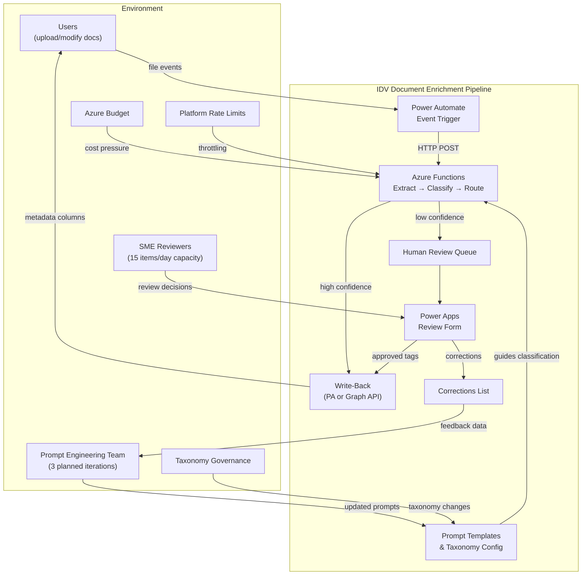
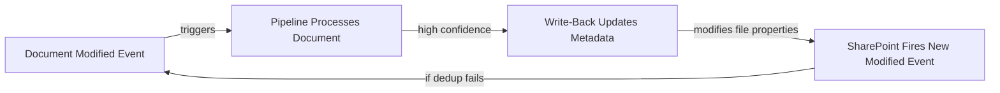
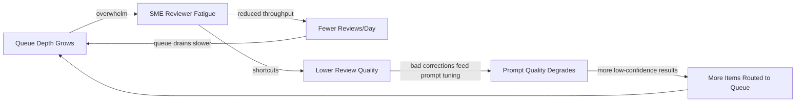
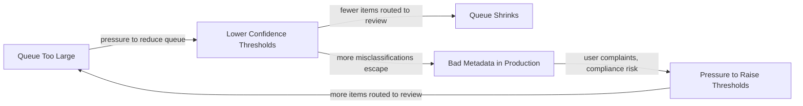
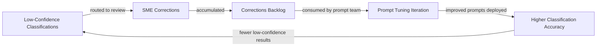
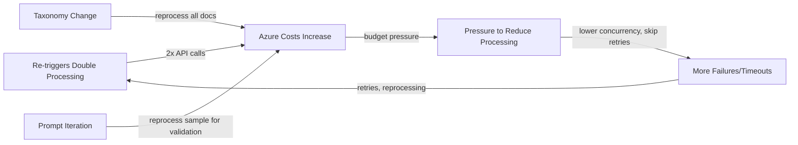
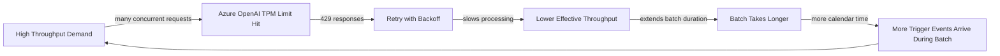
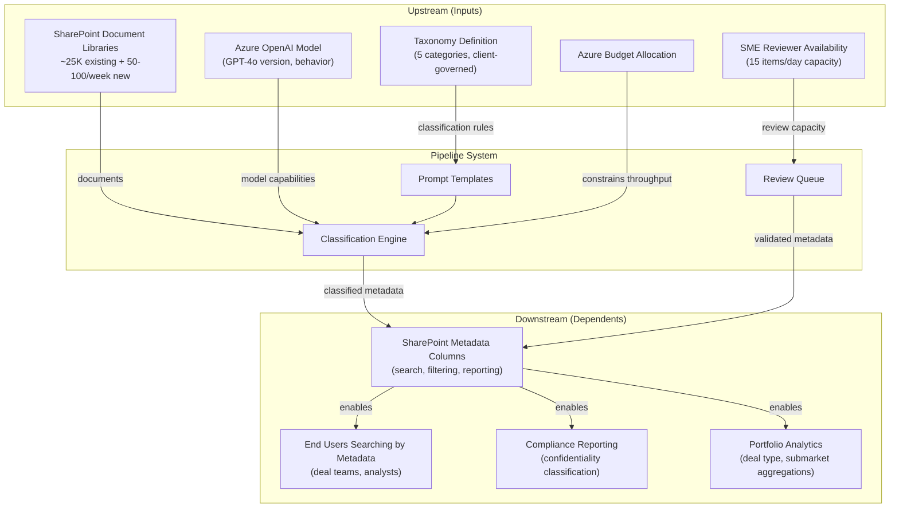

# System Dynamics Analysis: IDV Document Enrichment Pipeline

**Date:** 2026-07-30
**Analyst:** Systems Thinking Facilitator
**Status:** Initial analysis — hypotheses require validation during pilot

---

## 1. System Boundary

### Inside the System

| Component | Role |
|-----------|------|
| Power Automate trigger flow | Detects SharePoint file events, invokes pipeline |
| Azure Functions (Durable) | Orchestrates extract → classify → route |
| Azure OpenAI (GPT-4o) | Classifies documents against taxonomy |
| Azure AI Document Intelligence | Extracts text from documents |
| Confidence routing logic | Routes to auto-write or human review |
| Power Automate write-back flow | Writes metadata to SharePoint columns (trigger mode) |
| Graph API write-back | Writes metadata to SharePoint columns (batch mode) |
| Human review queue (SharePoint list) | Holds low-confidence items for SME review |
| Power Apps review form | UI for SME corrections |
| Review approval flow | Writes approved/corrected tags back to document |
| Prompt templates & taxonomy config | Controls classification behavior |
| Corrections list | Accumulates feedback for prompt tuning |

### Outside the System (Environment)

| External Actor/System | Interaction |
|----------------------|-------------|
| SME reviewers (humans) | Drain the review queue; source of corrections |
| SharePoint document libraries | Source of documents; destination for metadata |
| Users uploading/modifying documents | Generate trigger events |
| Prompt engineering team | Consumes corrections, produces improved prompts (3 iterations) |
| Azure cost management | Constrains budget; signals cost pressure |
| Taxonomy governance (client SMEs) | Defines and evolves the 5-category taxonomy |
| Azure platform rate limits | Constrains throughput (OpenAI TPM, Graph API) |

### Boundary Diagram

---

## 2. Stocks and Flows

| Stock | Inflow | Outflow | Unit | Current Estimate |
|-------|--------|---------|------|-----------------|
| **Unprocessed documents** | New/modified files arriving in SharePoint | Documents processed by pipeline | Documents | ~25,000 initial backlog; ongoing ~50-100/week (trigger mode) |
| **Review queue depth** | Low-confidence classifications routed to queue | SME reviews completed (approve/correct/reject) | Items | Target <15% × 25K = 3,750 items; drain rate = 15/day |
| **Corrections backlog** | Corrected items from review queue | Corrections consumed by prompt tuning iteration | Corrections | Accumulates until next iteration; estimated 10-20% of reviewed items |
| **Prompt quality** | Prompt tuning iterations incorporating corrections | Model drift, taxonomy changes invalidating prompts | Effective accuracy | Improves stepwise across 3 iterations |
| **Azure spend** | Every API call (OpenAI, Doc Intelligence, Graph) | Budget allocation | USD/month | ~$500-1,000 for initial batch (25K × ~$0.02-0.04/doc) |
| **Re-trigger events** | Write-back modifying file → new modify event | Dedup filter rejecting duplicate events | Events | Potentially 1:1 with successful write-backs |
| **SME reviewer fatigue** | Queue volume, repetitive decisions | Time off, rotation, training | Capacity (items/day) | 15/day target; fragile if queue >100 items |

---

## 3. Feedback Loops

### R1: Re-Trigger Amplification Loop (REINFORCING — CRITICAL RISK)

**Mechanism:** Power Automate triggers on "file created or modified." The pipeline classifies and writes metadata columns back to the same file. SharePoint records this as a modification, generating a new trigger event.

**Current mitigation:** Instance ID = `trigger:{siteId}:{itemId}:{modifiedDateTime}`. But write-back changes `modifiedDateTime`, creating a NEW valid instance ID that passes the dedup check.

**Worst case:** Every successful classification triggers a second processing attempt. At 25K docs in batch mode this is mitigated (Graph API write-back, no PA trigger). But in trigger mode: every auto-classified document gets processed TWICE — doubling costs, halving throughput, and potentially creating an infinite loop if the second classification produces a different confidence score (which writes back again, triggering a third event…).

**Stability assessment:** UNSTABLE without additional guards. The `modifiedDateTime`-based dedup is insufficient because the write-back itself mutates the very field used for deduplication.

**Dominance:** This loop is currently latent (not yet in production). Once trigger mode goes live, it will immediately dominate system behavior for every auto-classified document.

---

### R2: Review Queue Death Spiral (REINFORCING)

**Mechanism:** At 15% review rate and 15 items/day throughput, the batch creates a 250-business-day backlog. As the queue grows, reviewers face increasing cognitive load. Fatigue leads to either: (a) reduced throughput, (b) hasty approvals without careful review, or (c) increased skip rate. All three feed back into the problem.

**Critical numbers:**
- Batch inflow: 3,750 items (one-time)
- Trigger-mode inflow: ~7-15 items/week (15% of 50-100 new docs/week)
- Drain rate: 15 items/day = 75/week
- Net accumulation during batch: +3,750 items in days; drain takes 250 days
- If fatigue reduces throughput to 10/day: drain extends to 375 days

**Dominance:** This loop becomes dominant immediately after the initial batch run.

---

### B1: Confidence Threshold Balancing Loop (BALANCING — POTENTIALLY OSCILLATORY)

**Mechanism:** ADR-003 establishes per-category thresholds (0.70–0.85). When the queue grows unmanageably, stakeholders will pressure the team to lower thresholds. This reduces queue volume but increases misclassification risk. When misclassifications are discovered downstream, pressure reverses. The system oscillates between "too much review work" and "too many errors in production."

**Delay:** The feedback from misclassification to threshold adjustment is SLOW — errors may not be discovered for weeks or months (until someone uses the metadata and notices it's wrong). The delay makes this loop prone to over-correction.

**Stability:** Marginally stable IF thresholds are adjusted in small increments with measurement periods between changes. Unstable if adjusted reactively.

---

### B2: Prompt Tuning Improvement Loop (BALANCING — DELAYED)

**Mechanism:** This is the intended learning loop. Corrections inform prompt improvements, which reduce the review rate over time.

**Delays:**
1. Review delay: days to weeks (SME must review the item)
2. Accumulation delay: corrections sit until the prompt team runs the next iteration
3. Iteration delay: prompt tuning takes days (analysis, rewrite, testing, deployment)
4. Only 3 iterations planned — loop stops producing improvement after iteration 3

**Total loop delay:** Estimated 4-8 weeks per iteration. Documents processed between iterations don't benefit from corrections found during that period.

**Key risk:** With only 3 iterations, this loop may not converge. If the initial batch creates 3,750 review items, and the first iteration doesn't bring the review rate below 10%, the queue remains unmanageable.

---

### R3: Cost Escalation Loop (REINFORCING)

**Mechanism:** Each document costs ~$0.02-0.04 (2K input tokens × GPT-4o pricing + Doc Intelligence). Re-triggers double this. Retries on failures add 3x per attempt. Taxonomy changes or prompt iterations require reprocessing subsets. Budget pressure leads to cost-cutting (lower concurrency, fewer retries) which paradoxically increases failures and re-processing.

**Scale:** 25K docs × $0.03 = $750 baseline. With re-triggers: $1,500. With retries (10% failure rate, 3 retries each): +$225. With prompt validation reprocessing (3 iterations × 500 docs): +$45. Total realistic: ~$1,800 vs. $750 planned.

---

### B3: Rate Limiting Balancing Loop (BALANCING — EXTERNAL)

**Mechanism:** The Durable Functions orchestrator limits concurrency to 10 activity functions / 5 orchestrators. If Azure OpenAI's TPM limit is reached, 429 responses trigger exponential backoff. This extends batch processing time, during which new trigger-mode events continue arriving.

---

## 4. Delay Analysis

| Cause → Effect | Estimated Delay | Consequence of Ignoring |
|---------------|-----------------|------------------------|
| Write-back → re-trigger event | 1-3 minutes (PA polling interval) | Infinite loop goes undetected in testing; manifests in production |
| Correction submitted → prompt improved | 4-8 weeks (per iteration) | Documents processed between iterations carry uncorrected classification errors |
| Threshold adjusted → misclassification discovered | Weeks to months | Over-correction oscillation between "too strict" and "too lenient" |
| Batch submitted → review queue cleared | ~250 business days at 15/day | Queue becomes psychologically overwhelming; reviewers disengage |
| Cost increase → budget action | Monthly billing cycle | Overspend committed before anyone notices re-trigger doubling |
| Taxonomy change → full reclassification | Days to weeks (manual re-batch trigger) | Stale metadata coexists with new metadata; inconsistent search results |

---

## 5. Leverage Point Analysis

### Top 3 Leverage Points

| # | Leverage Point | Meadows Level | Current State | Proposed Intervention | Expected Effect | Risks |
|---|---------------|---------------|--------------|----------------------|----------------|-------|
| 1 | **Re-trigger loop break** | 5 (Feedback loop structure) | Write-back triggers re-processing; dedup relies on mutating field | Add write-back guard: either (a) filter events where `AIProcessingStatus` column is already set, (b) use a stable dedup key that excludes `modifiedDateTime` (e.g., `trigger:{itemId}:{contentHash}`), or (c) add `_ai_classified` flag that PA flow checks before invoking pipeline | Eliminates infinite loop entirely; halves trigger-mode API costs | (a) requires PA flow condition logic — if misconfigured, stops all processing; (b) content hash requires reading file content before dedup; (c) flag requires schema change |
| 2 | **Review queue drain rate** | 4 (Information flows) / 6 (Stock-and-flow structure) | 15 items/day capacity with 3,750 item backlog = 250 day drain | Restructure the batch approach: run batch in phases (5K docs per wave), only proceeding to next wave after review queue drains below threshold (e.g., <50 items). This converts a stock problem into a flow-matching problem | Queue never exceeds manageable size (~500-750 items per wave); reviewer morale maintained; corrections feed prompt tuning BEFORE next wave benefits from them | Extends total batch timeline from weeks to months; stakeholder patience required |
| 3 | **Prompt tuning iteration coupling** | 3 (Rules/incentives) | Corrections accumulate passively; 3 iterations planned regardless of data | Trigger prompt iterations based on correction VOLUME (e.g., every 200 corrections) rather than a fixed schedule, and reprocess the most recent wave with the improved prompt before starting the next wave | Each wave benefits from corrections found in the previous wave; convergence is data-driven rather than arbitrary | More prompt engineering effort; risk of over-fitting to early corrections |

### Additional Leverage Points (Lower Priority)

| # | Leverage Point | Level | Intervention | Effect |
|---|---------------|-------|-------------|--------|
| 4 | Confidence threshold calibration loop | 7 (Parameters) | Establish a calibration protocol: sample 100 auto-classified docs monthly, measure actual accuracy, adjust thresholds only if accuracy deviates >5% from target | Prevents reactive oscillation |
| 5 | Cost visibility | 4 (Information flows) | Add per-document cost tracking to Application Insights; surface daily cost in a dashboard visible to stakeholders | Prevents cost surprise; enables early detection of re-trigger loop |
| 6 | Review queue triage | 6 (Structure) | Auto-prioritize queue by: (a) documents with 1 low-confidence category first (quick wins), (b) most recent documents first (trigger-mode items) | Improves effective drain rate without adding reviewers |

---

## 6. Upstream / Downstream Map

### Upstream Risks

- **GPT-4o model update:** Azure OpenAI may update the model version, changing classification behavior without notice. Confidence calibration and thresholds become invalid overnight.
- **Taxonomy evolution:** If the client adds a 6th category or changes allowed values, all previously classified documents may need reclassification (triggering batch mode again, restarting the review queue problem).
- **Reviewer departure:** 15 items/day assumes dedicated reviewers. If an SME leaves or is reassigned, the drain rate drops and R2 (death spiral) accelerates.

### Downstream Risks

- **Metadata trust:** If early batch processing produces visible misclassifications (before prompt tuning converges), users may lose trust in AI-assigned metadata and stop relying on it — undermining the entire project's value proposition.
- **Compliance exposure:** Confidentiality misclassification (threshold: 0.85, highest) could expose sensitive documents. The 15% that go to review are protected; the 85% that auto-classify carry residual risk.

---

## 7. Key Insights

1. **The re-trigger loop is the most dangerous structural flaw.** The dedup strategy uses `modifiedDateTime` as part of the instance ID, but write-back mutates `modifiedDateTime`. This means every successful trigger-mode classification will generate a valid new event that passes dedup. This is not a theoretical risk — it is a guaranteed infinite loop without an additional guard. Fix before going live.

2. **The review queue is a structural bottleneck, not a capacity problem.** Adding more reviewers is a parameter change (Level 7). The real leverage is restructuring the batch into waves that match inflow to drain rate (Level 6). Running 25K documents through the pipeline in one shot creates a queue that takes over a year to clear — during which the corrections that would improve the pipeline are locked up waiting for review.

3. **The 3-iteration prompt tuning plan has no convergence guarantee.** If the review rate doesn't drop meaningfully after iteration 1, the queue problem compounds. Coupling iterations to data volume (every N corrections) rather than a fixed schedule creates a responsive feedback loop instead of an open-loop plan.

4. **Cost doubles silently.** The re-trigger loop means every trigger-mode document is processed twice. With ~2K input tokens per call, this is invisible in small volumes but compounds. At scale (100 docs/week trigger mode), it's 200 unnecessary API calls/week indefinitely.

5. **The confidence threshold system creates a hidden coupling between queue volume and classification quality.** There is no independent measurement of misclassification rate for auto-classified documents. The system only knows about errors when humans happen to notice wrong metadata downstream. This means the B1 balancing loop has a massive information delay — errors accumulate silently.

---

## 8. Mitigation Recommendations

### Immediate (Before Production)

| # | Action | Addresses | Effort |
|---|--------|-----------|--------|
| 1 | **Add re-trigger guard to PA trigger flow**: Check if `AIProcessingStatus` column is already "Classified" or "Reviewed" — if yes, skip. This breaks the R1 loop. | R1 (re-trigger) | Low (PA flow condition) |
| 2 | **Change dedup instance ID** to exclude `modifiedDateTime`: Use `trigger:{siteId}:{itemId}` with a TTL window (e.g., reject if same item processed within last 10 minutes via custom check) | R1 (re-trigger) | Medium (code change) |
| 3 | **Add cost alerting**: Set Azure Monitor alert if daily OpenAI spend exceeds 2× expected baseline | R3 (cost) | Low (infra config) |

### Structural (Before Batch Run)

| # | Action | Addresses | Effort |
|---|--------|-----------|--------|
| 4 | **Phase the batch into 5K-doc waves** with a queue-depth gate: don't start wave N+1 until review queue < 50 items | R2 (queue death spiral) | Medium (orchestrator logic) |
| 5 | **Trigger prompt iterations on correction volume** (every 200 corrections) rather than fixed schedule | B2 (prompt tuning delay) | Low (process change) |
| 6 | **Sample-audit auto-classified documents**: After each wave, randomly sample 50 auto-classified docs and have SME verify. This provides the missing accuracy signal for threshold calibration. | B1 (threshold oscillation) | Low (process + reporting) |

### Monitoring (Ongoing)

| # | Action | Addresses |
|---|--------|-----------|
| 7 | Dashboard: review queue depth, drain rate trend, average items/reviewer/day | R2 visibility |
| 8 | Dashboard: duplicate event count (409 responses from HTTP trigger) | R1 detection |
| 9 | Track per-wave review rate: if wave N+1 review rate isn't lower than wave N, pause and investigate | B2 convergence |
| 10 | Monthly accuracy audit: sample 100 auto-classified docs, measure misclassification rate by category | B1 threshold calibration |

---

## 9. System Archetype Recognition

### Archetype 1: Fixes That Fail (Re-trigger Dedup)

The `modifiedDateTime`-based dedup is a "fix" for duplicate events. But the fix interacts with write-back behavior in a way that creates new events that bypass the fix. The "fix" fails because it addresses the symptom (duplicate events) without addressing the structural cause (write-back mutates the dedup key).

### Archetype 2: Limits to Growth (Review Queue)

The pipeline's growth (processing throughput) encounters a limit (review queue capacity). The pipeline can process thousands of documents per day, but the review queue can only drain at 15/day. Growth in processing creates a proportional growth in queue, which eventually constrains the system's ability to deliver value (metadata isn't trusted until reviewed).

### Archetype 3: Shifting the Burden (Threshold Adjustment)

When the queue grows, the symptomatic solution is to lower thresholds (reduce queue inflow). The fundamental solution is to improve classification accuracy (through prompt tuning, better examples, or taxonomy refinement). The symptomatic solution is faster and easier, so it gets applied first — but it erodes the fundamental solution by reducing the volume of corrections that feed prompt improvement.
